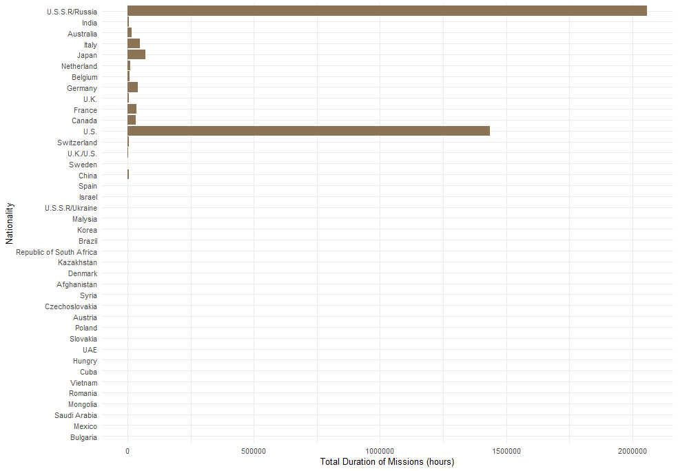
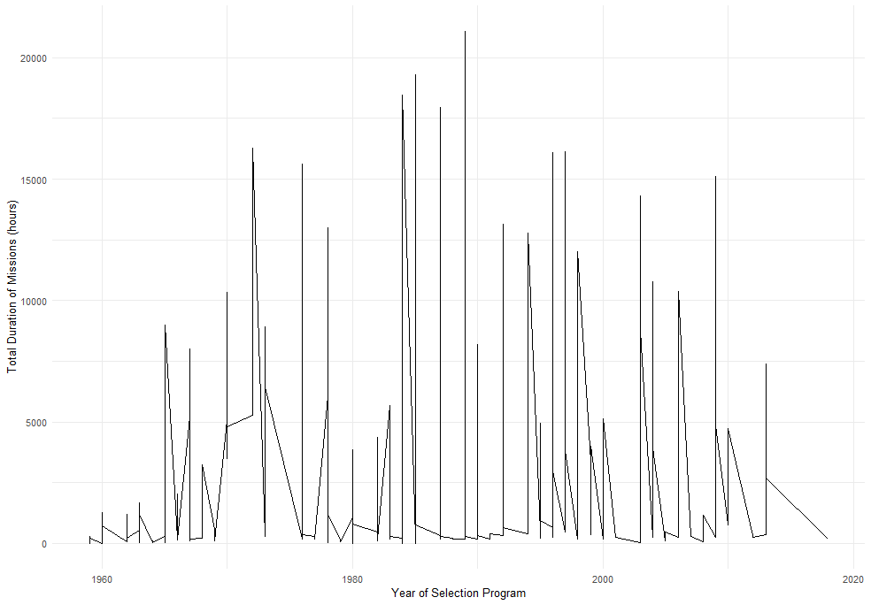
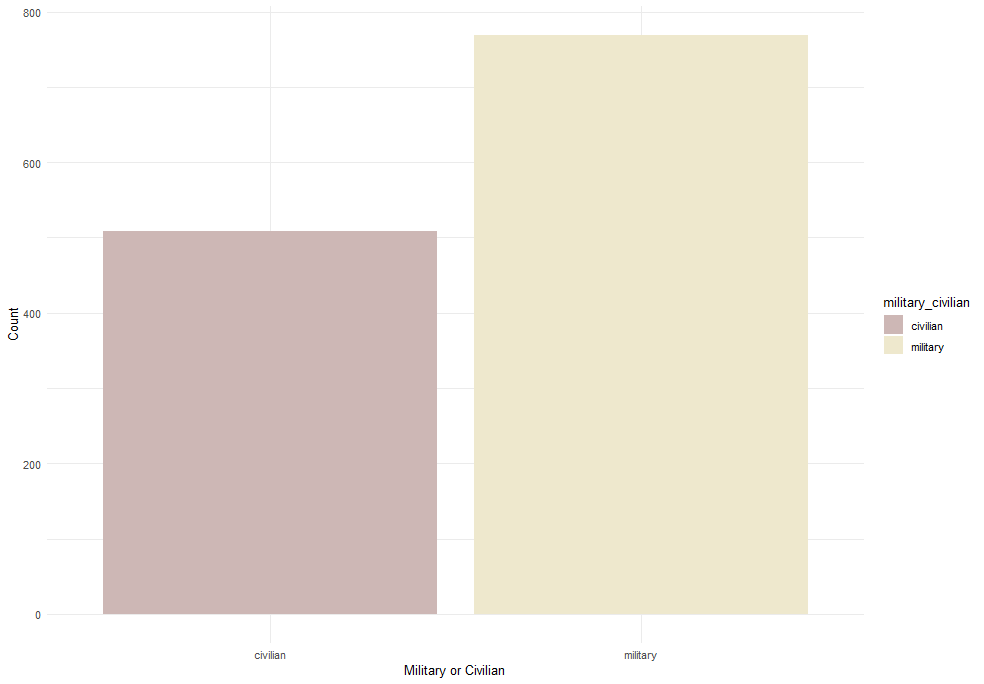
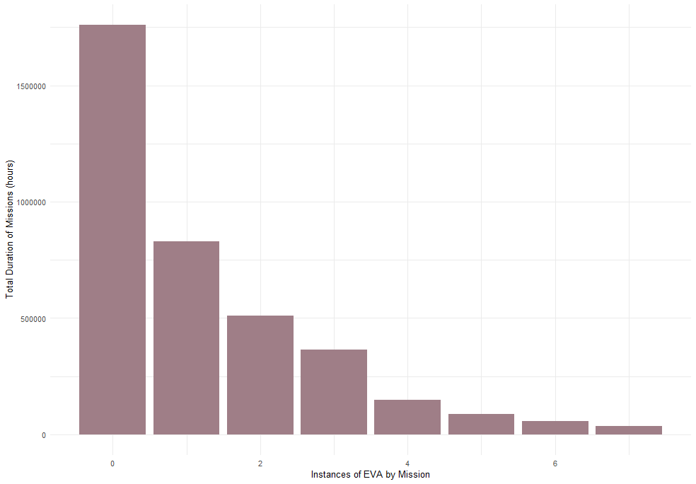
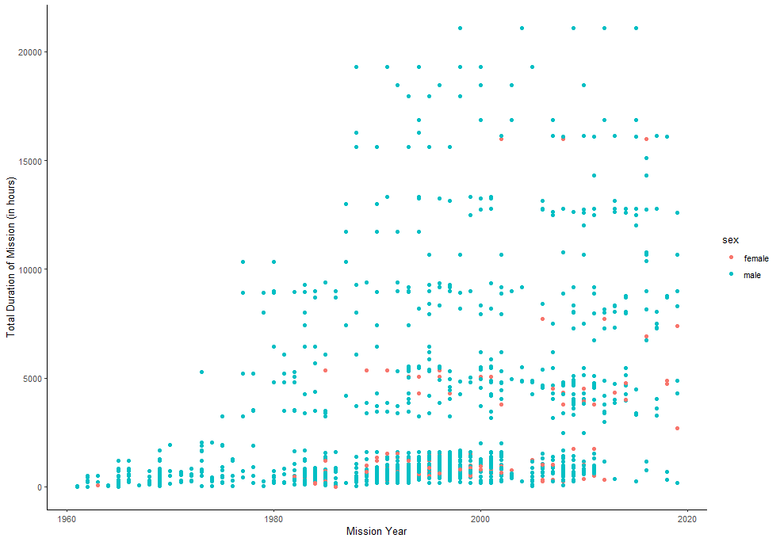
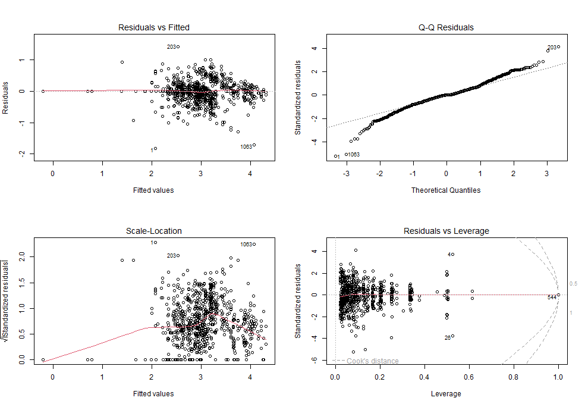
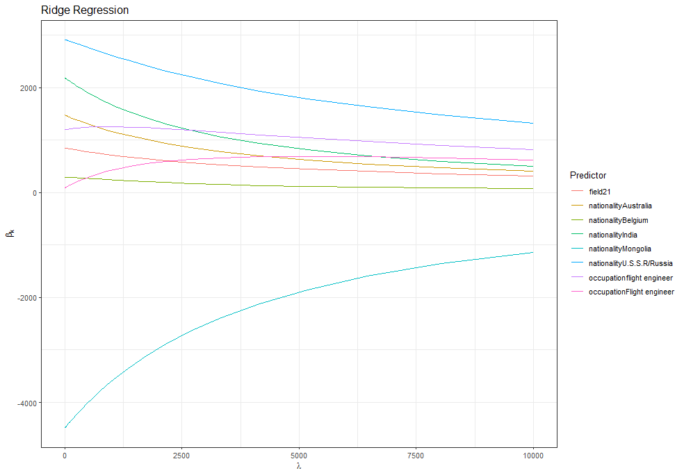
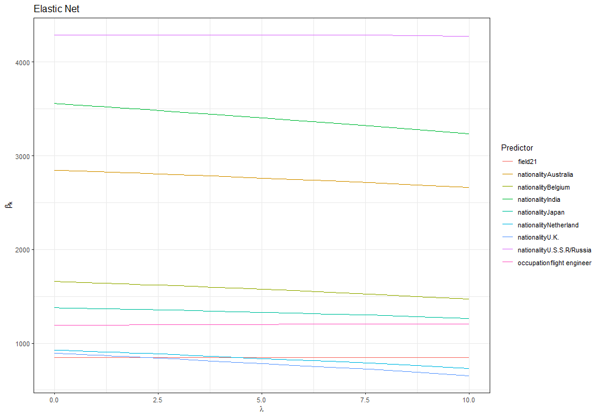
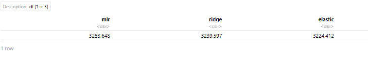

For this project I decided to use the Astronaut database. This data set comes from the tidytuesday github.

Let's begin by loading the needed packages, the data and cleaning it up as needed.

```toml
# loading the packages
library("tidymodels");theme_set(theme_bw())
library(readr)
library(dplyr) 
library("GGally")
library("olsrr")
library("glmnet")
library(tidyr)
library(ggplot2)
library(caret)

#loading the data
astronauts <- readr::read_csv('https://raw.githubusercontent.com/rfordatascience/tidytuesday/master/data/2020/2020-07-14/astronauts.csv')
```
As I delve into the data set, my focus is set on using the total number of missions as the dependent variable, with the other variables acting as predictors. Can we predict the total duration of all missions based on various factors, including the astronaut's nationality, the year of selection into the program, military or civilian status, the number of extravehicular activities, and the occupation of the astronaut ?

I am interesting in understanding how the total duration of all missions ('total_hrs_sum') vary across different nationalities? We can do that by creating a bar plot, showing the distribution of total duration of all missions in hours for each nationality.

```toml
ggplot(astronauts, aes(x = total_hrs_sum, y = reorder(nationality, total_hrs_sum))) +
  geom_bar(stat = "identity", fill = "#8B7355") +
  labs(x = "Total Duration of Missions (hours)", y = "Nationality") +
  theme_minimal()
```


Based on the graph, it becomes evident that certain countries have notably higher total numbers of missions in comparison to others. This trend is particularly observable in several Western European countries, Russia, and the United States. These findings provide insight on potential discrepancies in space mission participation among different countries, emphasizing specific nations' dominance in the realm of space exploration.

Another interesting variable to look at is whether there is a observable trend between the total duration of all missions and the year of selection into the program. This exploration seeks to determine whether there was a specific period characterized by increased frequency in space missions.



Analyzing mission duration in relation to the year of selection rather than the year of mission provides insights into astronaut training and preparation processes, providing understanding of training program effectiveness, resource allocation, and the impact of technological advancements on mission duration.Notably, the line plot reveals a significant surge in mission duration between the years 1980 and 2000, with a visible increase in mission duration that occurred around the mid-1970s. This observation hints at a potential shift in space exploration dynamics during that period, indicating a possible increase in mission duration due to advancements in technology and space exploration capabilities.

Exploring another intriguing relationship, I aim to investigate whether the distribution of total mission duration varies significantly between military and civilian astronauts.


```toml
duration_occ <- astronauts %>%
  count(military_civilian)
duration_occ

ggplot(duration_occ, aes(x = military_civilian, y = n, fill = military_civilian)) +
  geom_bar(stat = "identity") +
  scale_fill_manual(values = c("#CDB7B5", "#EEE8CD")) +
  labs(x = "Military or Civilian", y = "Count") +
  theme_minimal()
```


The visualization aligns with my initial assumptions, indicating that a significant proportion of astronauts come from a military background. This observation isn't surprising, given the government oversight of space agencies like NASA. Moreover, the noticeable dominance of military-affiliated individuals in space missions reflects the historical reliance on government-funded space exploration endeavors. Additionally, the entry of private companies into the space domain in the 21st century further diversified the astronaut pool, leading to an increased presence of civilians in space missions.

Extravehicular activity (EVA) is any activity done by an astronaut in outer space outside a spacecraft. Analyzing the relationship between the number of spacewalks (EVAs) performed during a mission and its overall duration can reveal important information about the effectiveness of resource management in space, the technical difficulties astronauts encounter during spacewalks, and the effects of these operations on astronaut safety and well-being. Knowing how these two factors interact can aid with mission planning, astronaut safety procedures, and ensuring mission success in space exploration.



The total duration of missions decreases as the instances of EVA missions increase, suggests a potential negative relationship between these two variables. This observation indicates that a higher number of EVA missions might be associated with shorter overall mission duration.

Finally let's see how the number of missions changed over the years.This analysis seeks to ascertain the overall trend in the number of missions completed over time. It aims to identify any patterns or changes in the frequency of space missions over time, providing insights into the overall historical trajectory of space exploration and the frequency of space missions. By incorporating the astronauts' gender, it also aims to investigate any potential shifts in gender representation throughout the history of space exploration.




The graph effectively emphasizes the astronaut cohort's prevalent gender disparity, with male representation significantly outweighing female representation. When the duration of missions is examined, it becomes clear that some female astronauts have logged more than 15,000 hours, demonstrating their noteworthy contributions to space exploration.

After the 1980s, a notable pattern develops, demonstrating a progressive increase in female participation in space missions. Furthermore, the graph demonstrates a significant overall increase in the number of missions, implying worldwide expansion and advancement of space exploration initiatives, stressing the continued push in the field of space research and travel.

## Regression Analysis:

### Multiple Linear Regression

To better grasp how each variable affects the model's ability to predict and how they relate to the outcome, we should start by running a multiple linear regression (MLR). In multi linear regression, the goal is to predict a dependent variable based on several independent variables.

Some variables in the columns are considered identity, have no variability, or are not relevant to the outcome of interest, so it is best to just remove them. This includes 'id,' 'number,' 'name,' and 'original_name'.

```toml
model <- lm(total_hrs_sum ~ sex + year_of_birth + nationality + military_civilian + selection + year_of_selection + occupation + year_of_mission + ascend_shuttle + in_orbit + descend_shuttle + field21 + eva_hrs_mission + total_eva_hrs, data=astronauts)

summary(model)
```

Other variables I decided to remove includes the hours_mission, which is kinda similar to my dependent variable. In the first model we that year of birth and year of selection were not significant suggests that neither the astronaut's age at the time of the mission nor the year they were selected are strong predictors of the total duration of their missions.The variable for sex (male) was not a significant predictor, indicating no substantial difference in mission duration. On the contrary nationalities such as Australia and France are significant predictors of the total mission duration. The most unexpected was the variable indicating military or civilian status was not a significant predictor, with a p value of 0.066.

Now, let's transform variables to achieve a better fit.
```toml
# first fit
fit <- lm(total_hrs_sum ~ nationality + field21 + selection + occupation, astronauts)
#summary(multi_fit)


#creating a recipe 
norm_recipe <- 
    recipe(
        total_hrs_sum ~ nationality  + selection + occupation, data= astronauts
    ) %>%
    step_other(nationality) %>% 
    step_dummy(all_nominal()) %>%
    step_center(all_predictors()) %>%
    step_scale(all_predictors()) %>%
    step_log(total_hrs_sum, base = 10) 

norm_recipe <- prep(norm_recipe)
prep_fit <- bake(norm_recipe, astronauts)

multifit_preprocess <- lm(total_hrs_sum ~ ., data = prep_fit)
#summary(multifit_preprocess)

# assess assumptions
par(mfrow = c(2,2))
plot(multifit_preprocess)

```


The Residuals vs Fitted plot indicates a lack of clear patterns, suggesting appropriate linearity, but the funnel shape points to heteroscedasticity. The Normal Q-Q plot reveals deviations from normality, especially in the tails. A few high-leverage points in the Residuals vs Leverage plot need investigation. Adjustments to the model, such as variable transformations or addressing influential points, may be necessary.

### Ridge Regression

When evaluating the data, multicollinearity is a possible issue. Ridge regression may be useful in addressing this issue. We can reduce the influence of multicollinearity and increase the accuracy of our investigation by using this regression technique.

```toml
y <- astronauts$total_hrs_sum

#define matrix of predictor variables
x <- model.matrix(~ nationality-1 + field21 + occupation - 1, astronauts)

scale_n<-85

lambdas <- 10^seq(-4, 4, length.out = scale_n)

ridge_mod <- glmnet(x, y, alpha = 0, lambda = lambdas)
coef(ridge_mod)[,1]

#cross validation 
cv_ridge_mode <- cv.glmnet(x, y, alpha = 0)
top_lambda <- cv_ridge_mode$lambda.min


coef(ridge_mod, s=top_lambda)
```

I decided to remove the selection predictor has it had a missing value. Nevertheless this regression model gives us a better understanding of our predictors! Here we see that nationality like the USSR/Russia have a large positive coefficient, suggesting a positive relationship with our response variable. Other nationalities like Denmark and Mongolia have the complete opposite, with a large negative coefficient. Field21 variable has a positive relationship also. And like before the occupation is a mix, when it comes to the association with the response.



The plot was difficult to understand because there were many nationalities clustered together. However, by filtering and including only the top variables with the lowest and highest values, the plot became much clearer and easier to interpret.

### Elastic Net

The Elastic Net model combines variable selection and regularization. It not only identifies the strongest positive and negative relationships with the response variable but also indicates which predictors may not be related by reducing their coefficients to zero. This is different from Ridge Regression, which doesn't perform variable selection and keeps all predictors while shrinking their coefficients to some extent.



Like the ridge regression, USSR/Russia still indicates the strongest positive relationship with the response variable. The nationality with the most negative coefficient is Denmark, with a coefficient of -2789.17. In this technique some of the coefficient are present as ".", which means their coefficients have been shrunk to zero; this includes Israel, Korea, Republic of South Africa,and Switzerland. Surprisingly the occupationFlight engineer has also has a zero coefficient.

### Methods Compared

To compare the different models, I'm focusing on an evaluation metric called RMSE. RMSE helps understand how accurately a model can predict the actual observations. The lower the RMSE value, the better the model's predictions align with the real data. By comparing the RMSE values of the models, we can determine which one performs closest to the actual observations.
```toml
set.seed(123)
# 10-fold cross-validation
train_control <- trainControl(method = "cv", number = 10, search = "grid")

# tuning grid for ridge  and elastic net
ridge_grid <- expand.grid(alpha = 0, lambda = 10^seq(-4, 1, length = 100))
elastic_grid <- expand.grid(alpha = seq(0.1, 0.9, by = 0.2), lambda = 10^seq(-4, 1, length = 100))

# mlr
mlr_results <- train(x, y, method = "lm", trControl = train_control)

# ridge regression
ridge_results <- train(x, y, method = "glmnet", tuneGrid = ridge_grid, trControl = train_control)

# elastic net
elastic_results <- train(x, y, method = "glmnet", tuneGrid = elastic_grid, trControl = train_control)

# Compare RMSE
results <- data.frame(
  mlr = min(mlr_results$results$RMSE),
  ridge = min(ridge_results$results$RMSE),
  elastic = min(elastic_results$results$RMSE)
)

results

```


The RMSE between each model does not have a striking difference. The elastic model has the lowest RMA among the three models, which means it strikes a good balance between bias and variance. This makes the elastic net model better at predicting new data.

## Conclusions

Certain variables, such as USSR/Russia, were strong predictors in our analysis. They were evident in our initial graph and were also important in both ridge and elastic regression models. However, some nationalities and occupations didn't contribute much to the predictions and had their coefficients reduced to zero in the Elastic Net model.

One limitation was the potential overfitting in the MLR model, which was addressed by using regularization in Ridge and Elastic Net. To improve further, we could explore more diverse sets of predictors and fix missing values.

The Elastic Net model's approach, which penalizes and selects variables, aligns well with the goal of identifying predictors associated with mission duration. This provides insights into the factors that influence mission length.

Our iterative approach emphasized the importance of regularization, cross-validation, and understanding which variables closely predict mission duration. It revealed valuable insights into the key factors driving mission lengths.
