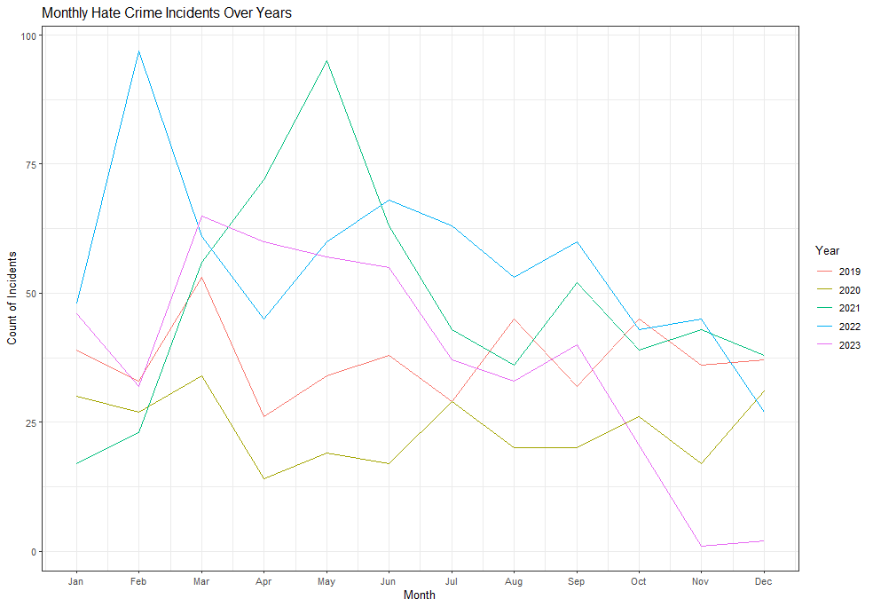
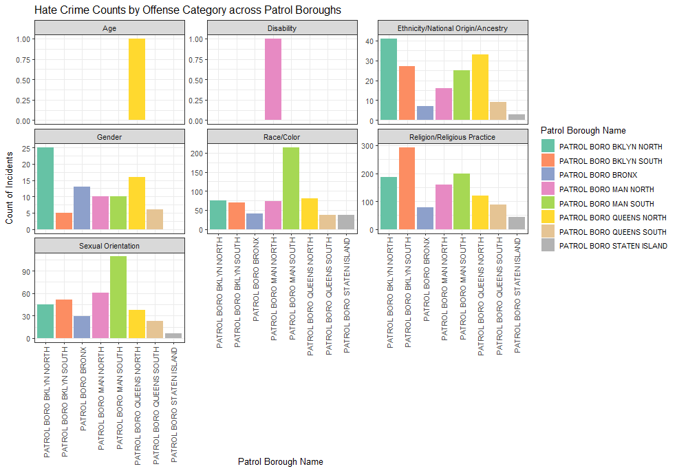
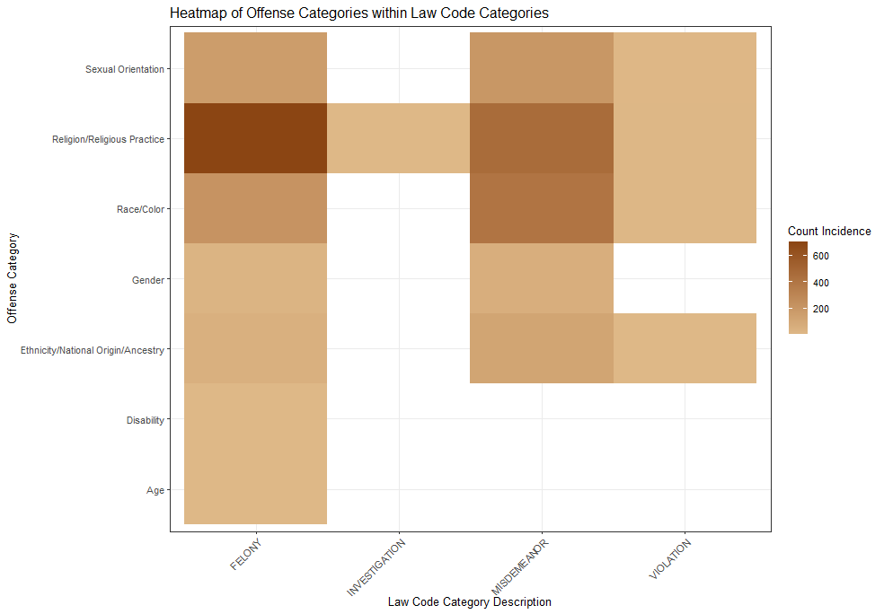
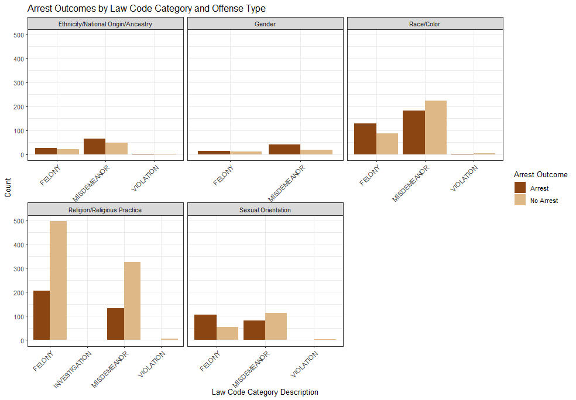
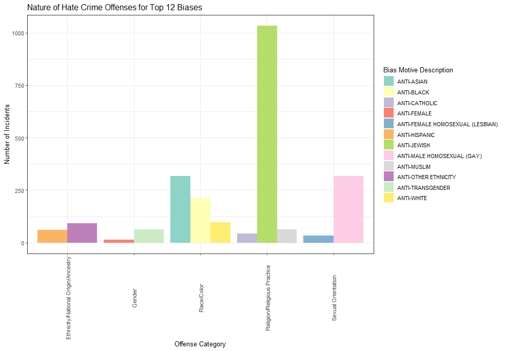
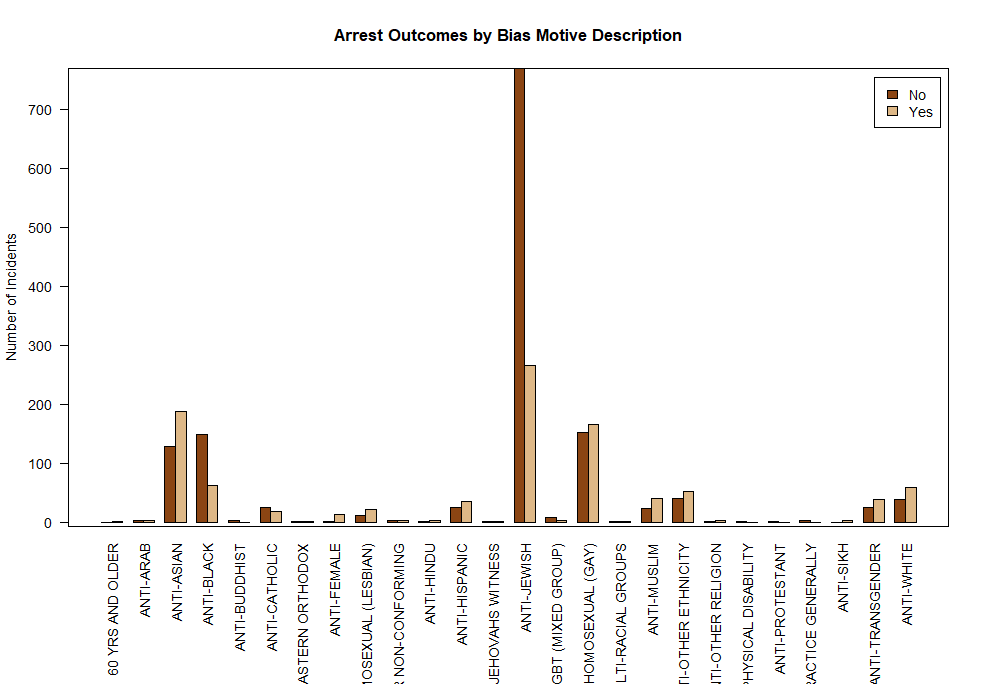
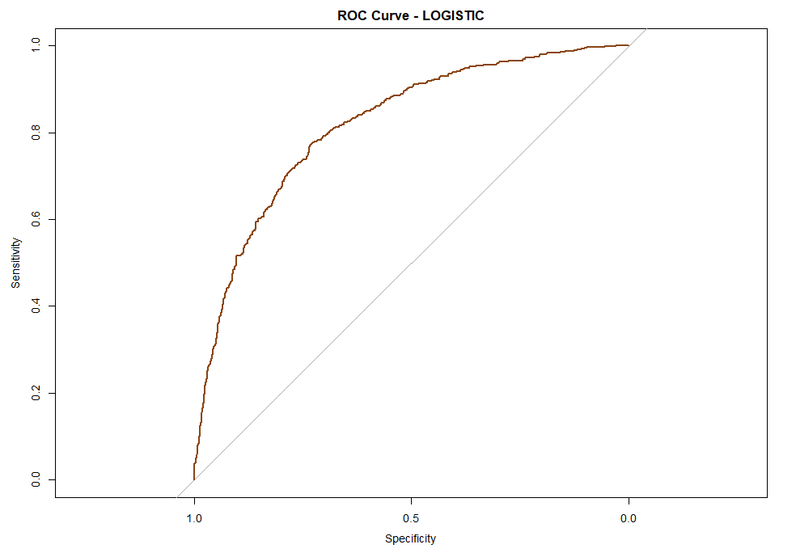
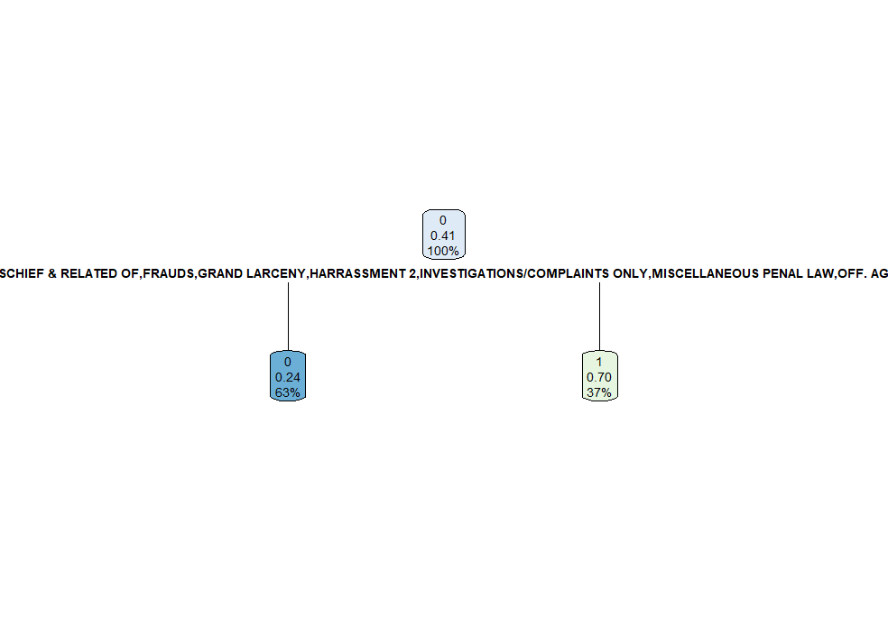
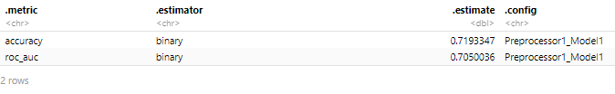

## Introduction

Exploring hate crimes in cities is crucial for community well-being and safety, especially in a diverse setting like New York City. The NYPD Hate Crimes dataset offers an in-depth look at these incidents in one of the world's most populous cities, capturing a variety of reported cases. This analysis is essential as hate crimes deeply affect community trust and target individuals based on immutable traits like race, religion, or sexuality. The shared goal of community leaders, policymakers, and law enforcement is to understand and address these crimes effectively.

This project focuses on analyzing the NYPD Hate Crimes dataset to uncover trends across different areas, times, and groups. It seeks to answer how hate crime trends in New York City vary by location, time, and demographic factors, and to identify key predictive elements. Using methods like logistic regression and tree-based models, the project aims to offer a clearer picture of hate crimes, aiding in more informed discussions and strategies to tackle this complex issue.

This data set was found in [NYC OpenData](https://data.cityofnewyork.us/Public-Safety/NYPD-Hate-Crimes/bqiq-cu78).

``` toml
library("tidyverse");theme_set(theme_bw())
library("tidymodels");theme_set(theme_bw())
library("MASS")
library("class")
library(tidyverse)
library(dplyr)
library(lubridate)
library(ggplot2)
library(knitr)
library(tidyr)
library(pROC)
library(caret)
library("rpart")
library("rpart.plot")

#load the data
library(readr)
data <- read_csv("NYPD_Hate_Crimes_20231202.csv")

#clean the data by removing unwanted columns
data<-subset( data, select = -c(`Full Complaint ID`, `Arrest Date`) )
```

| **Column Name**                   | **Description**                                |
|:--------------------------------|---------------------------------------|
| **Full Complaint ID**             | Identifier for each hate crimes incident       |
| **Complaint Year Number**         | Year in which incident occurred                |
| **Month Number**                  | Month in which incident occurred               |
| **Record Create Date**            | Date report was filed                          |
| **Complaint Precinct Code**       | NYPD Precinct in which incident occurred       |
| **Patrol Borough Name**           | NYPD Patrol Borough in which incident occurred |
| **County**                        | County in which incident occurred              |
| **Law Code Category Description** | Category of offense                            |
| **Offense Description**           | A description of the offense                   |
| **PD Code Description**           | The NYPD description of the offense            |
| **Bias Motive Description**       | NYPD category of hate crime or bias type       |
| **Offense Category**              | General categorization of hate crime type      |
| **Arrest Date**                   | Date arrest was made (if arrest happened)      |
| **Arrest Id**                     | Identifier for arrest (if made)                |

Columns in this Data set

## Exploratory Data Analysis (EDA)

In our analysis of New York City hate crimes, we shift our focus to whether an arrest was made, as indicated by NYPD records. This study aims to identify key factors influencing arrest outcomes in hate crime cases, such as the type of offense, location, time, and bias motivation. By exploring these elements, we intend to understand better how effectively and consistently hate crimes are addressed by law enforcement, providing insights for policy-making and resource allocation. This project seeks to answer: "Can we predict the likelihood of an arrest in hate crime incidents based on specific incident characteristics?

#### Temporal Patterns

A graph showing the temporal distribution of hate crime rates from 2019 to 2023 serves as the first visual aid for our investigation. This analysis aids in identifying possible seasonal patterns, the effects of particular events, and long-term changes in the number of hate crimes. These kinds of insights are essential for determining the peak times of hate crimes, which facilitates effective resource allocation and preventive strategy development.

``` toml
temp<-data%>%
  group_by(`Complaint Year Number`,`Month Number`)%>%
    summarize(Count = n())

ggplot(temp, aes(x = `Month Number`, y = Count, group = `Complaint Year Number`, color = as.factor(`Complaint Year Number`))) +
  geom_line() +
  labs(title = "Monthly Hate Crime Incidents Over Years",
       x = "Month",
       y = "Count of Incidents",
       color = "Year") +
  scale_x_continuous(breaks = 1:12, labels = month.abb)+
  theme_bw()
```



The graph presents a five-year trend of monthly hate crime incidents, highlighting fluctuations and certain months with heightened activity, such as February 2022 and May 2021. These variations suggest that specific times may see a higher rate of incidents, although no solid annual trend emerges, pointing to the influence of different factors each year. A mid-year rise in incidents is generally observed, indicating possible seasonal influences. The year begins with moderate incident levels, often dipping in April, except in unusual years like 2020, which likely reflects the unique societal impact of the COVID-19 pandemic. The data eventually levels out, suggesting a baseline that periodically rises or falls. This analysis confirms that hate crime patterns are not uniform year to year, highlighting the complexity of hate crime trends and the significance of external elements.

#### Geographical Distribution

Next, we shift our focus to the geographical distribution of hate crimes, analyzing how they are dispersed across different precincts or boroughs. This graph provides a breakdown by offense category, offering a clearer view of where certain types of hate crimes are more concentrated. Understanding these patterns is crucial as it helps law enforcement and community leaders to target interventions, allocate resources more effectively, and potentially uncover underlying causes linked to specific areas.

``` toml
geo <- data %>%
  group_by(`Offense Category`, `Patrol Borough Name`) %>%
  summarise(counts = n()) # 

ggplot(geo, aes(x = `Patrol Borough Name`, y = counts, fill = `Patrol Borough Name`)) +
  geom_bar(stat = 'identity', position = position_dodge()) +
  scale_fill_brewer(palette="Set2") +
   theme_bw()+
  facet_wrap(~`Offense Category`, scales = 'free_y') + 
  theme(axis.text.x = element_text(angle = 90, vjust = 0.5, hjust=1)) +
  labs(title = "Hate Crime Counts by Offense Category across Patrol Boroughs",
       x = "Patrol Borough Name",
       y = "Count of Incidents")
```



The data analysis indicates a disparity in the distribution of hate crimes across various boroughs, with particular offenses such as those motivated by race/color and religion displaying pronounced variations in frequency. Specific boroughs, notably Brooklyn North and Manhattan South, report a higher number of race/color-related incidents. Similarly, hate crimes based on religious practices are predominantly observed in the Brooklyn and Manhattan areas. Despite the diversity of hate crimes across boroughs, there seems to be a recurring pattern of certain areas consistently reporting higher incidents, which should be considered when devising prevention strategies.

These geographical trends suggest that factors such as local societal tensions or historical contexts may contribute to the prevalence of hate crimes in these precincts. On the other hand, the relatively minimal figures for hate crimes related to age and disability could indicate less frequent occurrences or a discrepancy in reporting rates for these types of offenses.

#### Exploring the Link of Offense and Law

When it comes to the relationship between offense categories and legal classifications, it is insightful to examine which offenses fall under which law code categories in the legal system's hierarchy. Since various sorts of crimes are grouped according to their magnitude, this categorization not only tells us about the frequency of particular offenses but also illuminates the perceived seriousness of each incidence.

**Violations**: *These are minor offenses, typically punishable by fines and not resulting in jail time. Examples include speeding tickets and jaywalking.*

**Misdemeanors**: *More serious than violations but less severe than felonies, misdemeanors can lead to up to a year in jail, fines, probation, or community service. Common examples include simple assault and DUI.*

**Felonies:** *The most serious offenses, classified by severity from Class A (most serious) to Class E. They can be violent or non-violent and often result in significant prison time. A Class A felony, like first-degree murder, could lead to life imprisonment.*



The heatmap shows that the legal system tends to categorize most offenses as felonies, especially those related to sexual orientation, religion, and race, highlighting an awareness of their seriousness. The dominance of felonies in the data points to the severe nature of hate crimes and suggests they can cause significant damage.

The data also includes misdemeanors and violations, which covers a variety of actions that might be less serious. Notably, crimes based on gender don't follow the same felony-dominant pattern, which may indicate a different legal treatment or differences in reporting or the nature of these crimes.

When it comes to `Arrest Id`, we see can assume that field is only populated when an arrest has been made, and the dataset documentation highlights it as "Identifier for arrest (if made)". However it is crucial to understand that this is an assumption. This leads us to our next question of What is the current state of arrest resolution for various hate crime incidents? How does the chance of arrest completion fluctuate among crime categories, and what does this reveal about law enforcement's response to varied bias motivations? This question aims to analyze the rate at which hate crimes lead to arrests, potentially revealing disparities in the law enforcement response to different types of hate crimes. I opted in dropping the age and disability as there was only one instance in the data.



Here we see distinct patterns in arrest outcomes for hate crimes, depending on the offense category and the severity of the charge. For ethnicity/national origin/ancestry-related offenses, there are more arrests for misdemeanors than felonies, but the number of arrests versus non-arrests is relatively balanced across both categories. Gender-related crimes also show a tendency for more arrests in misdemeanors compared to felonies, with arrests more likely than not in both categories.

In contrast, race/color-related crimes have the highest counts, with a greater number of misdemeanor offenses not leading to arrest compared to those that do. However, there is a substantial number of felony arrests as well, suggesting a serious approach to more severe incidents. On the other hand, the number of non-arrests for religious practice-related felonies is notably high, which might indicate challenges in progressing these cases to an arrest, despite their seriousness.

Crimes against sexual orientation show a higher arrest rate for felonies than for misdemeanors, although non-arrests are also significant in number for both categories. The presence of violations in the dataset is minimal compared to more severe charges, but they still result in arrests, indicating action is taken regardless of the offense's perceived severity.

These figures suggest that while arrests are being made for hate crimes across various categories, the likelihood of an arrest being made can differ significantly depending on the nature of the offense and the legal classification it receives. The data highlights complexities in law enforcement responses to hate crimes and suggests that while some categories see strong action, others may not be addressed with the same level of consistency.

Let's go more in depth and break breakdown NYPD's handling of offenses,we gain insight into which specific crimes are more likely to lead to an arrest. This data is critical for understanding the efficiency and focus of law enforcement's response to various crimes. The distinction between arrests made and not made across different PD code descriptions provides a clearer view of the system's priorities and challenges.

Table: Description of the Offenses By Arrest Count

| PD Code Description                                          | No Arrest | Arrest |
|:--------------------------------------|---------------:|---------------:|
| ASSAULT 3                                                    |       123 |    259 |
| ASSAULT 2,1,UNCLASSIFIED                                     |        91 |    204 |
| AGGRAVATED HARASSMENT 1                                      |       428 |    123 |
| AGGRAVATED HARASSMENT 2                                      |       232 |    108 |
| MENACING,UNCLASSIFIED                                        |        27 |     62 |
| CRIMINAL MISCHIEF 4TH, GRAFFIT                               |       253 |     31 |
| MISCHIEF,CRIMINAL, UNCL 2ND                                  |        30 |     31 |
| ROBBERY,OPEN AREA UNCLASSIFIED                               |         7 |     21 |
| CRIMINAL MISCHIEF,UNCLASSIFIED 4                             |        66 |     15 |
| ROBBERY,PERSONAL ELECTRONIC DEVICE                           |         6 |     12 |
| CRIMINAL MIS 2 & 3                                           |        35 |     10 |
| LARCENY,GRAND FROM PERSON,UNCL                               |        17 |      7 |
| OBSTR BREATH/CIRCUL                                          |         0 |      6 |
| ROBBERY,POCKETBOOK/CARRIED BAG                               |         4 |      6 |
| MISCHIEF, CRIMINAL 3 & 2, OF M                               |        13 |      5 |
| MISCHIEF, CRIMINAL 4, BY FIRE                                |         5 |      5 |
| ASSAULT POLICE/PEACE OFFICER                                 |         1 |      4 |
| BURGLARY,UNCLASSIFIED,NIGHT                                  |         3 |      4 |
| CHILD, ENDANGERING WELFARE                                   |         1 |      4 |
| MANSLAUGHTER,UNCLASSIFIED - NO                               |         1 |      4 |
| MENACING 1ST DEGREE (VICT NOT                                |         1 |      4 |
| MISCHIEF, CRIMINAL 4, OF MOTOR                               |        13 |      4 |
| ROBBERY,COMMERCIAL UNCLASSIFIED                              |         0 |      4 |
| CRIMINAL CONTEMPT 1                                          |         0 |      3 |
| HARASSMENT,SUBD 1,CIVILIAN                                   |         4 |      3 |
| ROBBERY,PUBLIC PLACE INSIDE                                  |         0 |      3 |
| STRANGULATION 1ST                                            |         1 |      3 |
| WEAPONS POSSESSION 3                                         |         0 |      3 |
| HARASSMENT,SUBD 3,4,5                                        |        11 |      2 |
| LARCENY,GRAND FROM PERSON,PERSONAL ELECTRONIC DEVICE(SNATCH) |         2 |      2 |
| MAKING TERRORISTIC THREAT                                    |        15 |      2 |
| RECKLESS ENDANGERMENT 1                                      |         2 |      2 |
| RECKLESS ENDANGERMENT 2                                      |         1 |      2 |
| RESISTING ARREST                                             |         0 |      2 |
| ROBBERY,BEGIN AS SHOPLIFTING                                 |         0 |      2 |
| ROBBERY,DWELLING                                             |         0 |      2 |
| SEXUAL ABUSE                                                 |         0 |      2 |
| ARSON 2,3,4                                                  |         0 |      1 |
| ASSAULT OTHER PUBLIC SERVICE EMPLOYEE                        |         0 |      1 |
| BURGLARY,COMMERCIAL,DAY                                      |         0 |      1 |
| CONTROLLED SUBSTANCE,POSSESS.                                |         0 |      1 |
| CRIMINAL POSSESSION WEAPON                                   |         0 |      1 |
| HOMICIDE,NEGLIGENT,UNCLASSIFIE                               |         1 |      1 |
| IMPRISONMENT 1,UNLAWFUL                                      |         0 |      1 |
| LARCENY,GRAND BY EXTORTION                                   |         0 |      1 |
| LARCENY,GRAND BY THEFT OF CREDIT CARD                        |         0 |      1 |
| LARCENY,GRAND FROM BUILDING (NON-RESIDENCE) UNATTENDED       |         0 |      1 |
| LARCENY,GRAND FROM PERSON, BAG OPEN/DIP                      |         0 |      1 |
| LARCENY,PETIT FROM BUILDING,UN                               |         4 |      1 |
| LARCENY,PETIT FROM STORE-SHOPL                               |         0 |      1 |
| MURDER,UNCLASSIFIED                                          |         0 |      1 |
| RAPE 1                                                       |         0 |      1 |
| ROBBERY,CAR JACKING                                          |         0 |      1 |
| ROBBERY,CLOTHING                                             |         2 |      1 |
| ROBBERY,RESIDENTIAL COMMON AREA                              |         0 |      1 |
| SEXUAL ABUSE 3,2                                             |         1 |      1 |
| TRESPASS 3, CRIMINAL                                         |         1 |      1 |
| ARSON 1                                                      |         1 |      0 |
| BURGLARY,RESIDENCE,UNKNOWN TIM                               |         1 |      0 |
| BURGLARY,TRUCK NIGHT                                         |         1 |      0 |
| FALSE REPORT 1,FIRE                                          |         1 |      0 |
| FRAUD,UNCLASSIFIED-MISDEMEANOR                               |         1 |      0 |
| INVESTIGATE CHILD ABUSE                                      |         1 |      0 |
| LARCENY,GRAND FROM OPEN AREAS, UNATTENDED                    |         1 |      0 |
| LARCENY,GRAND FROM RESIDENCE, UNATTENDED                     |         1 |      0 |
| LARCENY,PETIT FROM BUILDING,UNATTENDED, PACKAGE THEFT INSIDE |         1 |      0 |
| LARCENY,PETIT FROM OPEN AREAS,                               |         1 |      0 |
| MENACING 1ST DEGREE (VICT PEAC                               |         1 |      0 |
| MISCHIEF, CRIMINAL 3&2, BY FIR                               |         1 |      0 |
| ROBBERY,NECKCHAIN/JEWELRY                                    |         3 |      0 |
| UNCLASSIFIED COMPLAINT                                       |         1 |      0 |

The table reveals several insights into the NYPD's handling of offenses. High arrest rates for crimes such as 'Aggravated Harassment 1' and 'Assault 3' suggest a strong response to violent and threatening behavior. However, a significant number of these incidents still do not result in arrest, potentially due to various factors such as the complexity of the case, lack of evidence, or victim cooperation issues.

For offenses like 'Criminal Mischief 4th, Graffiti,' the number of non-arrests substantially outnumbers the arrests, indicating potential challenges in apprehending or prosecuting perpetrators of property crimes. Interestingly, 'Menacing, Unclassified' shows a more balanced approach between arrests and non-arrests, perhaps reflecting the varying degrees of severity and evidence available in these cases. Furthermore, for more severe crimes labeled as felonies, such as 'Robbery, Personal Electronic Device' and 'Mischief, Criminal, Unclassified 2nd,' the arrest counts are closely aligned with the number of non-arrests, suggesting that while these are high-priority offenses, they also present significant investigative or prosecutorial difficulties. In contrast, certain types of larceny, particularly 'Larceny, Grand from Building (Non-Residence) Unattended' and 'Larceny, Grand from Person, Personal Electronic Device (Snatch),' result in arrests more often than not, which could imply a higher success rate in resolving theft-related offenses. Overall, the data illustrates the NYPD's varied response to different crimes, with some offenses having a higher likelihood of arrest.

#### Nature of Offenses

Here we are looking at the bias, meaning the motivation behind these hate crimes. There is about 24 bias in the dataset, I resorted to only using the top 12, as some biases were more common than others.

``` toml
top_biases <- data1 %>%
  group_by(`Bias Motive Description`) %>%
  summarise(Count = n()) %>%
  top_n(12, Count) %>%
  pull(`Bias Motive Description`) 

filtered_data <- data1 %>%
  filter(`Bias Motive Description` %in% top_biases) %>%
  group_by(`Offense Category`, `Bias Motive Description`) %>%
  summarise(Count = n()) %>%
  arrange(`Offense Category`, desc(Count))

ggplot(filtered_data, aes(x = `Offense Category`, y = Count, fill = `Bias Motive Description`)) +
  geom_bar(stat = "identity", position = position_dodge()) +
  theme_bw()+
  scale_fill_brewer(palette="Set3") +
  theme(axis.text.x = element_text(angle = 90, vjust = 0.5)) +
  labs(title = "Nature of Hate Crime Offenses for Top 12 Biases",
       x = "Offense Category",
       y = "Number of Incidents",
       fill = "Bias Motive Description")
```



From the graph, we can discern that religiously motivated hate crimes are most frequently directed against individuals of the Jewish faith, as indicated by the substantial height of the bar in the 'Religion/Religious Practice' category. This prevalence suggests a concerning level of anti-Semitic sentiment, which may mirror persistent societal biases. In terms of race/color, anti-Asian biases appear to be the most prevalent, followed by anti-Black and anti-White biases, though to a lesser extent. This indicates that hate crimes based on race are primarily targeted towards the Asian community, highlighting the serious issue of racism that continues to affect this group disproportionately. When looking at offenses categorized under 'Sexual Orientation,' hate crimes against male homosexuals (gay) are the most common, followed by those against female homosexuals (lesbian), which can be seen as a reflection of homophobia in society. In the gender we see a conciderable amount for the trans. The graph also shows a notable number of incidents categorized as anti-Hispanic and anti-Muslim, suggesting that these groups are significant targets of hate crimes related to ethnicity/national, origin/ancestry and religion, respectively. This data reveals the specific prejudices these communities face.

Now let's see the arrest for these bias, and try to draw further conclusions.



The bar plot provides a nuanced view of how arrest outcomes for hate crimes vary with respect to the reported bias motive. For certain biases, such as those against Asian, transgender, Hispanic, and white individuals, the number of arrests surpasses the number of incidents where no arrest was made. This could suggest that such incidents either have a higher rate of solvability, perhaps due to clearer evidence, more direct reporting, or greater law enforcement focus. It might also reflect societal and legal emphases on protecting these groups, potentially influenced by media attention or political priorities.

Conversely, the plot reveals a different pattern for anti-black and anti-Jewish hate crimes, where incidents not leading to arrests are more common than those that do. This disparity may point to systemic issues within the investigative process or indicate challenges in securing sufficient evidence to lead to an arrest. There could also be sociopolitical factors at play that affect the law enforcement response to these incidents. For instance, historical and structural biases may impact how seriously these crimes are taken and how aggressively they are pursued by the authorities.

## Modeling Techniques:

### Logistic Regression

I chose logistic regression for this dataset because it's well-suited for predicting the binary outcome of my 'Arrest_Made' variable. This model is ideal for exploring how different factors like 'Offense Category', 'Bias Motive Description', and 'Patrol Borough Name' influence the odds of an arrest in hate crime cases. Unlike linear regression, logistic regression works perfectly with categorical data, like my arrest outcomes, without any assumption violations. It allows me to include various predictors and comprehensively analyze law enforcement responses to hate crimes.

``` toml
# convert all other columns to factors
model_data <- data1 %>%
  mutate(Arrest_Made = factor(Arrest_Made, levels = c('No Arrest', 'Arrest'), labels = c(0, 1))) %>%
  mutate(across(everything(), as.factor))
#remove arrest id & recorded date
model_data <- subset(model_data, select = -c(`Arrest Id`,`Record Create Date`))
#split the data into a split into test and training
set.seed(123)
split <- initial_split(model_data , prop = .80)
```

To begin the modeling process, I used an all-inclusive approach, integrating all available variables from the dataset, with the exception of 'Arrest ID,' which was replaced by 'Arrest Made'. In addition, because the information already had the 'Complaint Year Number' and 'Month Number,' I elected to omit the 'Recorded Create Date' to prevent repetition. This deliberate exclusion aided in identifying the most important factors, positively and negatively impacting our model. This method eventually reduced the dataset to six important variables. Using these six variables, I created a model, the summary of which is shown below.

``` toml
set.seed(123)
lg_train <- training(split)
lg_test  <- testing(split)
#remove Disability, only one occurrence 
lg_train<- lg_train %>% 
  filter(`Offense Category` != "Disability")

lg_test<- lg_test %>% 
  filter(`Offense Category` != "Disability")

logistic <- glm(Arrest_Made ~ `Complaint Year Number`+`Bias Motive Description`+`Month Number`+`Complaint Precinct Code`+`Law Code Category Description`+`Offense Description`, data = lg_train, family = binomial())

#summary(logistic)
```

In the summary, it was evident that among the six predictors, several specific variables stood out for their significance. For instance, in terms of positive influences, the 'Complaint Year Number' for the years 2020 through 2023 emerged as notably significant, suggesting a visible change in hate crime trends over these years. Similarly, the 'Month Number' for each month from February to December was identified as a crucial factor, indicating that the time of year plays a substantial role in the occurrence of hate crimes. The 'Complaint Precinct Code' also proved to be pivotal, with almost all precinct codes showing significant impact, thus highlighting the importance of location in predicting hate crimes. In addition, categories under 'Law Code Category Description', such as Investigation, Misdemeanor, and Violation, were found to be significant, underscoring the nature of the crime as a key predictor. The 'Offense Description', which includes varied offenses like assault, burglary, dangerous drugs, and weapons, pointed towards specific types of crimes that are more frequently associated with hate crimes. Furthermore, the 'Bias Motive Description' with different biases like anti-Asian, anti-Black, and anti-Buddhist was significant, reflecting the specific biases most associated with hate crimes.

To assess the accuracy of our model's predictions, I've opted to use the ROC (Receiver Operating Characteristic) and AUC (Area Under the Curve), both standard metrics in classification model evaluation. The AUC, in particular, is crucial as it quantifies how well the model distinguishes between the different outcomes. It's a value that ranges from 0 to 1, where a score of 1 indicates flawless predictions, 0.5 implies performance no better than random chance, and 0 suggests entirely incorrect predictions.

** \[1\] "AUC: 0.817009892994145"**

Looking at the ROC, we observe a distinct curve that approaches the upper left corner of the plot. This is a good indicator since it shows that our model is capable of properly categorizing outcomes. The AUC value of 0.824 confirms this, indicating that our model has a significant capacity to distinguish between situations where an arrest was made and those where it was not. This higher AUC value indicates that our model is not only accurate in its predictions but also consistent in its ability to eliminate false positives and false negatives. It's especially crucial in our scenario of forecasting arrest results in hate crime occurrences, because the difference between correct and incorrect forecasts has serious consequences. The form of the ROC curve and the AUC score, when combined, offer us confidence in the model's prediction power and value in practical applications.

Nevertheless, this initial assessment doesn't account for potential overfitting or other issues like data variance and model bias. To achieve a more accurate and generalization measure of our model's performance, I implemented a 10-fold cross-validation. This approach was consistently applied across all our models, setting the stage for a fair comparison later on.

``` toml
# check the levels of the outcome variable
levels(lg_train$Arrest_Made)
lg_train$Arrest_Made <- make.names(lg_train$Arrest_Made)

# cross-validation with logistic regression
control <- trainControl(method = "cv", number = 10, classProbs = TRUE, summaryFunction = twoClassSummary)

set.seed(123) 
model_cv <- train(
  Arrest_Made ~ `Complaint Year Number`+`Bias Motive Description`+`Month Number`+`Complaint Precinct Code`+`Law Code Category Description`+`Offense Description`, 
  data = lg_train, 
  method = "glm", 
  family = "binomial",
  trControl = control,
  metric = "ROC"
)

model_cv
```

**Generalized Linear Model 1923 samples 6 predictor 2 classes: 'X0', 'X1' No pre-processing Resampling: Cross-Validated (10 fold) Summary of sample sizes: 1730, 1731, 1731, 1731, 1731, 1731, ...**

**Resampling results: ROC Sens Spec0.7409562 0.7699085 0.6089744**

The AUC of the ROC curve after cross-validation is 0.75, which is slightly lower than the AUC before cross-validation. This modest drop might be due to a variety of things. For example, the model may be highly tailored to the training data, resulting in poor performance on unknown data sets.Furthermore, the cross-validation procedure may reveal shortcomings in the model's capacity to generalize across diverse subsets of data, which is critical for assuring robust predictions.

### Decision Tree

The final model in our study is a decision tree, which sorts data using simple rules and is excellent for making sense of complex information. It's chosen for its ability to deal with different types of data and to show us the patterns in how hate crime arrests are made. We'll use all the relevant variables we have, leaving out only those we've already found to be unhelpful.
``` toml
(fit_m)
n= 1923 

node), split, n, loss, yval, (yprob)
      * denotes terminal node

 1) root 1923 790 0 (0.5891836 0.4108164)  
   2) Offense Description=ARSON,CRIMINAL MISCHIEF & RELATED OF,FRAUDS,GRAND LARCENY,HARRASSMENT 2,INVESTIGATIONS/COMPLAINTS ONLY,MISCELLANEOUS PENAL LAW,OFF. AGNST PUB ORD SENSBLTY &,PETIT LARCENY 1210 291 0 (0.7595041 0.2404959)  
     4) Complaint Precinct Code=1,10,13,14,17,18,19,20,22,24,25,26,28,30,33,34,40,41,43,44,45,46,48,49,52,60,61,62,66,70,73,75,76,77,78,79,83,88,94,102,104,105,107,108,110,111,115,121,122,123 826 132 0 (0.8401937 0.1598063) *
     5) Complaint Precinct Code=5,6,7,9,23,32,47,50,63,67,68,69,71,72,81,84,90,100,101,103,106,109,112,113,114,120 384 159 0 (0.5859375 0.4140625)  
      10) Bias Motive Description=ANTI-BLACK,ANTI-BUDDHIST,ANTI-HINDU,ANTI-JEHOVAHS WITNESS,ANTI-JEWISH,ANTI-LGBT (MIXED GROUP),ANTI-MALE HOMOSEXUAL (GAY),ANTI-RELIGIOUS PRACTICE GENERALLY,ANTI-TRANSGENDER,ANTI-WHITE 305 104 0 (0.6590164 0.3409836) *
      11) Bias Motive Description=ANTI-ASIAN,ANTI-CATHOLIC,ANTI-FEMALE HOMOSEXUAL (LESBIAN),ANTI-HISPANIC,ANTI-MULTI-RACIAL GROUPS,ANTI-MUSLIM,ANTI-OTHER ETHNICITY,ANTI-OTHER RELIGION 79  24 1 (0.3037975 0.6962025)  
        22) Complaint Precinct Code=6,9,23,69,71,84,100,114,120 28  10 0 (0.6428571 0.3571429) *
        23) Complaint Precinct Code=5,7,63,67,72,90,101,103,106,109,112 51   6 1 (0.1176471 0.8823529) *
   3) Offense Description=ASSAULT 3 & RELATED OFFENSES,BURGLARY,CRIMINAL TRESPASS,DANGEROUS DRUGS,DANGEROUS WEAPONS,FELONY ASSAULT,HOMICIDE-NEGLIGENT,UNCLASSIFIE,KIDNAPPING & RELATED OFFENSES,MURDER & NON-NEGL. MANSLAUGHTE,OFFENSES AGAINST PUBLIC ADMINI,OFFENSES AGAINST THE PERSON,ROBBERY,SEX CRIMES 713 214 1 (0.3001403 0.6998597)  
     6) Complaint Precinct Code=1,19,20,22,26,32,34,40,41,45,46,66,67,73,77,78,81,88,94,100,108,112 128  54 0 (0.5781250 0.4218750) *
     7) Complaint Precinct Code=5,6,7,9,10,13,14,17,18,23,24,25,28,30,33,42,43,44,48,49,50,52,60,61,62,63,68,70,71,72,75,76,79,83,84,90,101,102,103,104,106,107,109,110,111,113,114,115,120,121,122 585 140 1 (0.2393162 0.7606838) *
```

The rationale behind using an unpruned decision tree was to determine which of the six selected variables ranked as most significant in predicting hate crime arrests. Upon examining the visual representation of the decision tree, it becomes clear that 'Offense Description' emerges as the most significant variable. This outcome aligns well with intuitive expectations, as different crimes are often prioritized based on factors such as the severity of the offense, the presence of witnesses, and the ease of prosecuting the suspect. For instance, crimes involving physical harm tend to be given higher priority.

In our analysis of 1924 cases, the decision tree initially segregates cases based on the type of offense, indicating a stark difference in arrest likelihood between categories like burglary and fraud compared to more severe offenses like arson and assault. The tree further refines these categorizations by considering 'Complaint Precinct Code' and 'Bias Motive Description', highlighting that both the crime location and the nature of the bias involved are crucial in predicting arrest outcomes. For example, the likelihood of an arrest varies significantly with different combinations of precincts and bias motives. This in-depth perspective from the unpruned tree provides a thorough comprehension of the subtle patterns seen in the data, emphasizing the offense type's crucial role in influencing the likelihood of an arrest in hate crime instances.



In the prune tree, at its root; the tree categorizes the incidents based on 'Offense Description'. One major division includes offenses like burglary, fraud, and grand larceny, where the likelihood of an arrest is lower ('0'). The other division comprises more severe offenses such as arson, assault, and dangerous drugs, which show a higher likelihood of leading to an arrest('1').

Using the tidymodels library, I fine-tuned and evaluated a decision tree model for classification, optimizing its parameters through cross-validation to predict arrests in hate crime incidents accurately.
```toml
r_train$Arrest_Made <- as.factor(r_train$Arrest_Made)

control <- trainControl(
  method = "cv",
  number = 10,
  classProbs = TRUE,
  summaryFunction = twoClassSummary
)

cv_samples <- vfold_cv(r_train, v = 10)  # Use the same number of folds as specified in trainControl

dt_model <- decision_tree(mode = "classification", 
                          cost_complexity = tune(), 
                          tree_depth = tune()) %>% 
  set_engine("rpart")

dt_recipe <- recipe(Arrest_Made ~ `Complaint Year Number`+`Bias Motive Description`+`Month Number`+`Complaint Precinct Code`+`Law Code Category Description`+`Offense Description`, data = r_train)

dt_wf <- workflow() %>% 
  add_model(dt_model) %>% 
  add_recipe(dt_recipe)

# grid tunning
tree_grid <- grid_regular(cost_complexity(),
                          tree_depth(),
                          levels = 10)

# tune on the grid
tree_res <- dt_wf %>% 
  tune_grid(
    resamples = cv_samples,
    grid = tree_grid
  )

# find the best
best_tree <- tree_res %>% 
  select_best("accuracy")

# final  workflow
final_wf <- dt_wf %>% 
  finalize_workflow(best_tree)

# metrics 
final_wf %>% 
  last_fit(r_split,data = r_train) %>% 
  collect_metrics()

# predictions 
preds <- final_wf %>% 
  last_fit(r_split,data = r_train) %>% 
  collect_predictions()
```


The accuracy indicated that the model correctly predicted whether an arrest was made approximately 72% of the time. The ROC AUC was around 0.70 also suggesting a good ability to distinguish between the arrest made and no arrest made. It's not perfect, but it's considerably better than random guessing. It also seems to align with around the same amount as the other models.

## **Results:**

The EDA of NYPD hate crimes revealed key patterns. Peaks in crimes during months like February 2022 and May 2021 suggest possible seasonal or event-related influences. Hate crimes showed uneven geographical distribution, with Brooklyn North and Manhattan South reporting more race/color-related incidents, indicating local factors at play. Most offenses are felonies, particularly those based on sexual orientation, religion, and race, highlighting their severity. However, a concerning trend is the lower arrest rates for religious hate crimes, notably anti-Semitic incidents, which might indicate challenges in the justice system. The analysis also showed discrepancies in arrest outcomes based on bias motives, raising questions about systemic issues in law enforcement responses.

In our study, we employed two modeling techniques - Multiple Logistic Regression, Linear and Decision Tree - each with six key variables to analyze hate crime arrests. Logistic Regression provided a strong starting point, showing an AUC of 0.824, which slightly decreased to 0.75 after cross-validation, indicating a solid but not infallible predictive ability.The Decision Tree, both in pruned forms, offered valuable insights with an accuracy of 72% and an AUC around 0.70, demonstrating good predictive capacity though slightly lower than the other models. Overall, the Logistic model proved to be the most robust in predicting hate crime arrests, showcasing the highest accuracy in our analysis.

While the models like logistic regression and decision trees provided valuable insights, they have limitations. Overfitting might have occurred, where models performed well on training data but not as effectively on new, unseen data. Also, relying solely on AUC as a performance metric doesn't account for the different types of errors a model might make. Advanced techniques such as Random Forests or Gradient Boosting Trees could potentially yield better results, as they handle complex patterns more effectively and are generally more robust against overfitting. However, these sophisticated models often trade off interpretability for accuracy. Moreover, if our dataset was imbalanced, it could have led to biased results, favoring the majority class. Exploring these advanced models and addressing the mentioned limitations could enhance the accuracy and reliability of our findings in hate crime arrest predictions

## **Conclusion:**

Our analysis of the NYPD hate crimes dataset revealed noteworthy disparities in the occurrence of hate crimes and the subsequent law enforcement responses, including arrests, based on offense type and bias motivation. Through various modeling techniques, we identified key factors influencing arrest outcomes, such as the nature of the offense and the time of occurrence. Notably, violent crimes were more often associated with arrests compared to non-violent ones. Each model we employed, while offering distinct perspectives, collectively underscored the feasibility of predicting arrest likelihood in hate crime cases using specific incident characteristics.

The cross-validation Even though none of the models had perfect AUC, they were all informative and showed reasonable predictive ability. This thorough research clarified the complex dynamics guiding hate crime instances and their legal resolutions, in addition to demonstrating the viability of utilizing data-driven algorithms for such predictions. Overall, this initiative improved our knowledge of the patterns of hate crimes and the critical factors influencing the likelihood of an arrest.
