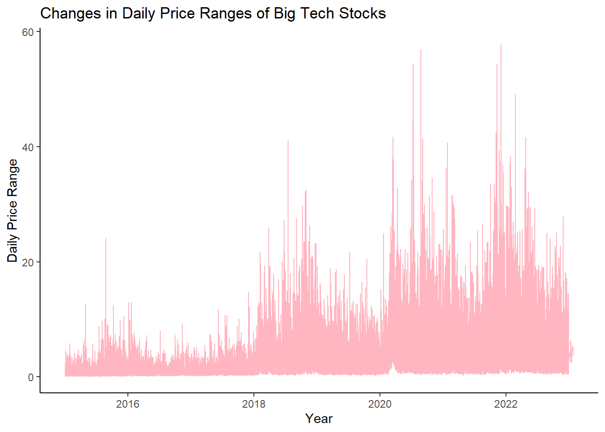
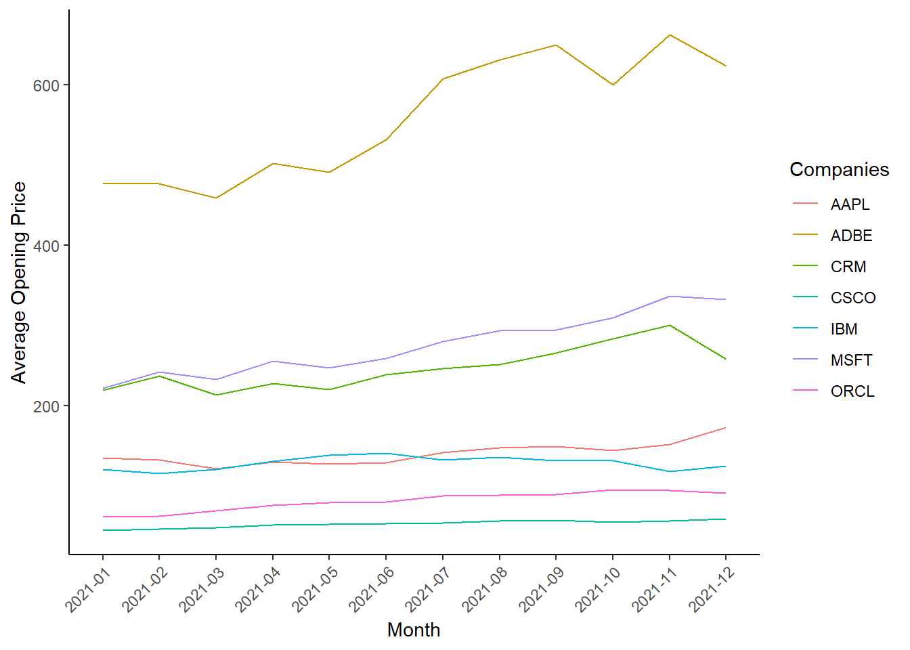
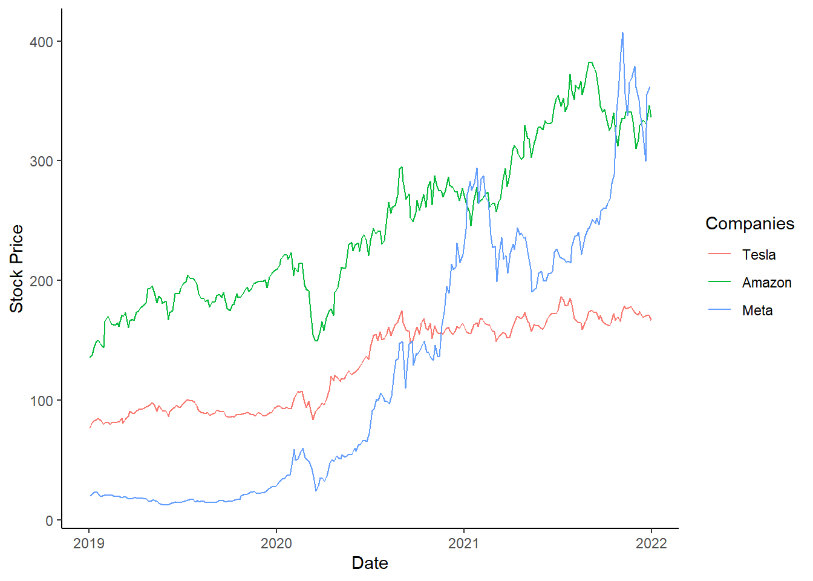

For this project, I have chosen a data set on Big Tech stock prices that was published on February 7, 2023. The data set reveals a significant and sudden decrease in stock prices in 2022. Interestingly, mega-cap technology stocks were considered one of the most promising investments for stock investors in 2020 and 2021. This contrasting trend raises a compelling question: Have these tech giants reached their maximum potential?

Let’s start off by loading the data into R
```toml
big_tech_stock_prices <- readr::read_csv('https://raw.githubusercontent.com/rfordatascience/tidytuesday/master/data/2023/2023-02-07/big_tech_stock_prices.csv')
big_tech_companies <- readr::read_csv('https://raw.githubusercontent.com/rfordatascience/tidytuesday/master/data/2023/2023-02-07/big_tech_companies.csv')
```
**Group 1: E-commerce and Consumer Tech**
1. Amazon.com, Inc. (AMZN)
2. Meta Platforms, Inc. (META)
3. Netflix, Inc. (NFLX)

**Group 2: Enterprise Solutions and Technology**
1. Apple Inc. (AAPL)
2. Adobe Inc. (ADBE)
3. Salesforce, Inc. (CRM)
4. Cisco Systems, Inc. (CSCO)
5. International Business Machines Corporation (IBM)
6. Microsoft Corporation (MSFT)
7. Oracle Corporation (ORCL)

**Group 3: Specialized Technology and Innovation**
1. Alphabet Inc. (GOOGL)
2. Intel Corporation (INTC)
3. NVIDIA Corporation (NVDA)
4. Tesla, Inc. (TSLA)

Let’s check if the claim in the article is true using a simple method. We’ll analyze some important numbers about the closing prices for the years mentioned as the best and worst. The closing price shows what people think about a stock on a specific day, so it gives us an idea of the overall market mood. We’ll look at the average, middle value (median), and total of the closing prices. These statistics help us understand the typical and overall values for each year.
```toml
stock_prices_2020 <- big_tech_stock_prices%>%
  filter(date >= "2020-01-01", date <= "2020-12-31") %>%
    summarise(
    mean_close = mean(close),
    median_close = median(close),
    total_close = sum(volume)
  )

stock_prices_2022 <- big_tech_stock_prices %>%
  filter(date >= "2022-01-01", date <= "2022-12-31") %>%
  summarise(
    mean_close = mean(close),
    median_close = median(close),
    total_close = sum(close)
  )

(stock_prices_2020)
```
  A tibble: 1 × 3
  mean_close median_close  total_close
       <dbl>        <dbl>        <dbl>
1       162.         119. 182993751952

```toml
(stock_prices_2022)
```
  A tibble: 1 × 3
  mean_close median_close total_close
       <dbl>        <dbl>       <dbl>
1       175.         151.     612478.


Next, let’s see the changes in daily prices through the years. Examining the historical fluctuations in price ranges enables us to pinpoint periods characterized by high or low volatility. This info can come in handy for making smart trading plans, managing risks, and getting a feel for what folks in the market are thinking.
```toml
big_tech<-big_tech_stock_prices%>%
    filter(date >= "2015-01-01")

ggplot(big_tech, aes(x = date, y = high - low)) +
  geom_line(color="lightpink") +
  labs(x = "Year", y = "Daily Price Range") +
  ggtitle("Changes in Daily Price Ranges of Big Tech Stocks")+
  theme_classic()
```



Observing the frequent occurrence of price drops raises the question of whether this pattern is considered normal in the realm of trading.

I am curious about the connection between the opening and closing prices of different big tech companies and how this connection varies across different months. To explore this, I will focus on the year 2021 and calculate the average prices for each month. By conducting this analysis, I hope to uncover insights into the dynamic nature of prices and identify any possible patterns.The companies will be from group 2.



Upon observation, there are distinct patterns evident in the data. For instance, in the month of March, we observe a decrease in prices for a few companies. In contrast, the subsequent year exhibits a slight increase. Notably, Adobe demonstrates a visible pattern of fluctuation, with alternating months of price increases and decreases.

During the epidemic, consumer technology companies such as META might have observed an increase in their stock prices as a result of greater time spent at home and people’s boredom. Similarly, e-commerce companies like Amazon could have benefited from the growing preference for contactless and convenient deliveries. Did the epidemic influence the stock prices of major tech companies, based on their specific objectives? This can be examined by comparing the adjusted closing prices.



The graph illustrates a significant surge in META’s stock price during 2020, surpassing both Tesla and Amazon at one point. This rise can be attributed to increased user engagement, which can be explained by the fact that more people were staying at home and seeking connections with others through social media. It is reasonable to expect platforms like Facebook and Instagram to experience heightened user engagement.
