## Key Threats

As a child, I feared bees for their painful stings without appreciating their vital ecological role. While stings are unpleasant, bees only sting to defend themselves and their hive. In fact, bees are prolific pollinators sustaining diverse ecosystems and enabling successful food crop production that our agricultural system relies on.

Declining bee populations from pesticides, habitat loss, climate change, and disease is alarming. My wariness of stings now mixes with awe at bees’ resilience. Though stings briefly hurt, I accept the discomfort knowing it connects me to the expansive pollination systems bees make possible.

My goal is to raise awareness of threats facing honeybees and their indispensable pollination services through data-driven storytelling.

Let’s begin by uploading the data. The data particular comes from U.S Department of Agriculture, but tidytuesday github has made it easier to load and extract.

```toml
colony <- readr::read_csv('https://raw.githubusercontent.com/rfordatascience/tidytuesday/master/data/2022/2022-01-11/colony.csv')
stressor <- readr::read_csv('https://raw.githubusercontent.com/rfordatascience/tidytuesday/master/data/2022/2022-01-11/stressor.csv'
```
We will be implementing two various data sets.

The Colony data set, focuses on quantifying bee colonies directly, provides colony count and change metrics by year, month and state. Overall captures trajectory of total bee colonies and population changes.
```toml
# A tibble: 1,222 × 10
    year months        state     colony_n colony_max colony_lost colony_lost_pct
   <dbl> <chr>         <chr>        <dbl>      <dbl>       <dbl>           <dbl>
 1  2015 January-March Alabama       7000       7000        1800              26
 2  2015 January-March Arizona      35000      35000        4600              13
 3  2015 January-March Arkansas     13000      14000        1500              11
 4  2015 January-March Californ…  1440000    1690000      255000              15
 5  2015 January-March Colorado      3500      12500        1500              12
 6  2015 January-March Connecti…     3900       3900         870              22
 7  2015 January-March Florida     305000     315000       42000              13
 8  2015 January-March Georgia     104000     105000       14500              14
 9  2015 January-March Hawaii       10500      10500         380               4
10  2015 January-March Idaho        81000      88000        3700               4
# ℹ 1,212 more rows
# ℹ 3 more variables: colony_added <dbl>, colony_reno <dbl>,
#   colony_reno_pct <dbl>
```
The stressor data set, focuses on external stress factors affecting be colonies -pesticides, diseases, climate etc. It links stressors to time frames and locations, as well as the impacts in percentage of colonies affect per quarter.
```toml
# A tibble: 7,332 × 5
    year months        state   stressor              stress_pct
   <dbl> <chr>         <chr>   <chr>                      <dbl>
 1  2015 January-March Alabama Varroa mites                10  
 2  2015 January-March Alabama Other pests/parasites        5.4
 3  2015 January-March Alabama Disesases                   NA  
 4  2015 January-March Alabama Pesticides                   2.2
 5  2015 January-March Alabama Other                        9.1
 6  2015 January-March Alabama Unknown                      9.4
 7  2015 January-March Arizona Varroa mites                26.9
 8  2015 January-March Arizona Other pests/parasites       20.5
 9  2015 January-March Arizona Disesases                    0.1
10  2015 January-March Arizona Pesticides                  NA  
# ℹ 7,322 more rows
```
Im interested in understanding the changes in colony numbers over time in various US states. Let’s begin by examining data from six randomly selected states to gain a clearer perspective. To ensure diversity, I’ve chosen states from different regions.

```toml
states_sample<-colony %>%
  filter(state %in% c('Oregon','Iowa','Louisiana','Vermont','California','Pennsylvania'))

ggplot(states_sample, aes(x = year, y = colony_n, color = months)) +
  geom_line() +
  facet_wrap(~ state, ncol = 2, scales = "free_y") +
  labs(title = "Total Colony Numbers Over Time Across Different US States",
  x = "Year", y = "Colony Numbers") +
  theme_minimal()
```
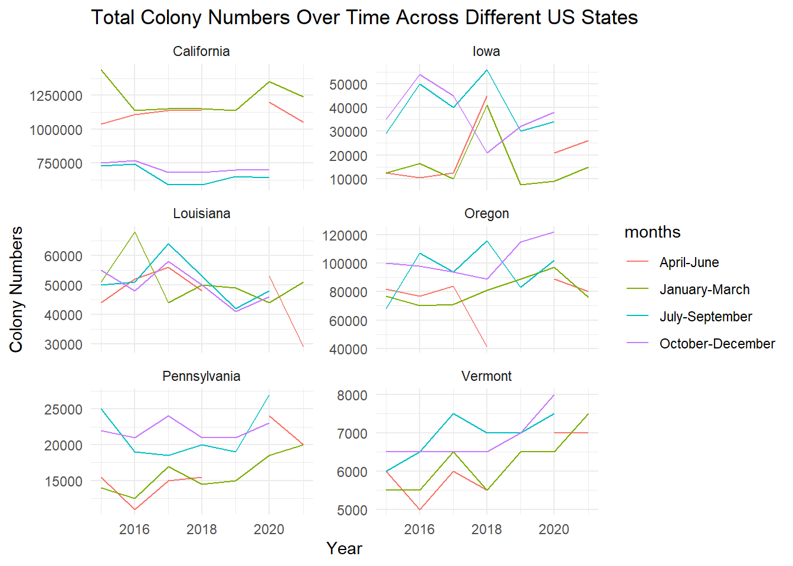


Most states display a similar pattern of fluctuation in colony numbers across years and months. For example, Pennsylvanian and Vermont display peaks in between fall to winter and fall rather than summer. Meanwhile, California stands out for having a relatively stable colony count over time, without the seasonal highs and lows seen in other states. One commonality is that all states are missing data for April through June of 2018. This gap in the middle of the year makes it difficult to fully assess seasonal trends for that time period. Additional years of data could help determine if 2018 is an anomaly or if spring months regularly lack measurements.


## Overall Trends

This analysis looks at recent 5-year colony trends between 2015-2019 given the available data range. To prepare the data, I filtered the data set to only include complete years within this period for valid comparisons. Examining the states with extreme high or low net changes over this short time frame highlights rapidly improving or worsening areas that may warrant closer investigation.

This is the five states with the biggest growth:
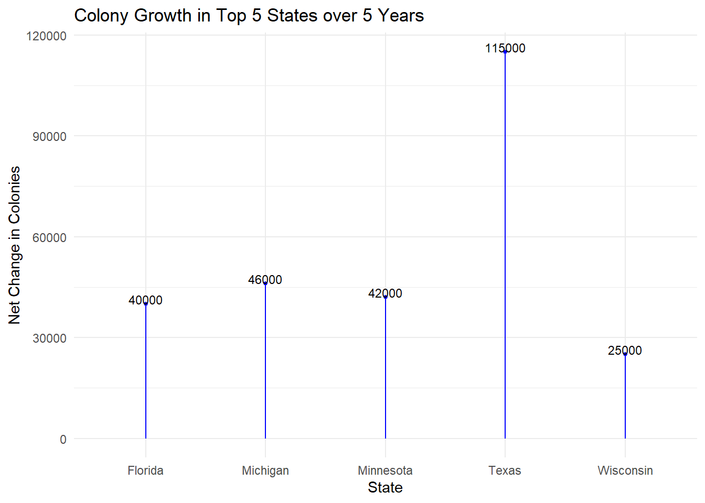

This is the five states with the biggest decline:

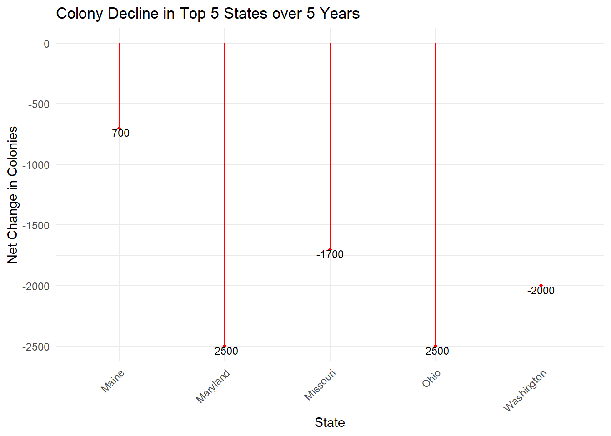

The slope charts reveal Texas as a dramatic positive outlier with a net growth of around 115,000 colonies, over double any other state. Florida, Michigan, Minnesota, and Wisconsin also saw substantial gains between 25,000 to 42,000. On the decline side, most states experienced gradual drops of -15,000 or less, but Ohio and Maryland saw steeper decreases nearing -50,000 colonies.

Seeing states like Texas and Florida with large expansions could point to favorable climates, land availability, or agricultural practices supporting beekeeping. Meanwhile, the states with steep declines may reflect urbanization pressure, reduced foraging habitat, or climate stresses negatively impacting colonies. Comparing adjoining states in different directions could help identify regional factors that differentiate success and struggles.

While these net changes highlight growth and declines, they do not account for proportional size differences among states. Larger states can have bigger swings in raw totals. Analyzing changes per existing colony or other metrics could improve normalization. Additionally, linking to stressor and land use data may reveal correlations to explore in future work.

The stressor data set does not directly quantify climate change impacts, it does include variables like disease prevalence that can be linked to weather factors. For example, research shows Varroa mite infestations increase when temperatures rise but decline during heavy rains and high winds (Rowland, 2021).

I want to explore the potential correlation between diseases affected by climate and colony loss rates. Specifically, we can use the data on Varroa mite effects as a proxy for temperature-sensitive diseases. If colonies affected by Varroa mites also exhibit higher loss percentages, it suggests a connection between increasing heat and colony collapses.

Examining relationships between diseases like Varroa mites and colony losses can provide indirect insight into how climate shifts may be impacting bee populations. While not a perfect measure, analyzing these available variables can act as a starting point.

```toml
merged_data <- left_join(colony, stressor, by = c("year", "months", "state"))

mites_data <- merged_data %>%
  filter(stressor == "Varroa mites")

correlation_result <- cor.test(mites_data$stress_pct, mites_data$colony_lost_pct)

(correlation_result)
```
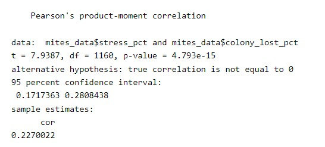

```toml
ggplot(mites_data, aes(x = stress_pct, y = colony_lost_pct)) +
  geom_point(color="brown") +
  labs(title = "Correlation between Varroa mites and Colony Loss Rates",
       x = "Varroa mites",
       y = "Colony Loss Rates (%)")+
  theme_minimal()
```
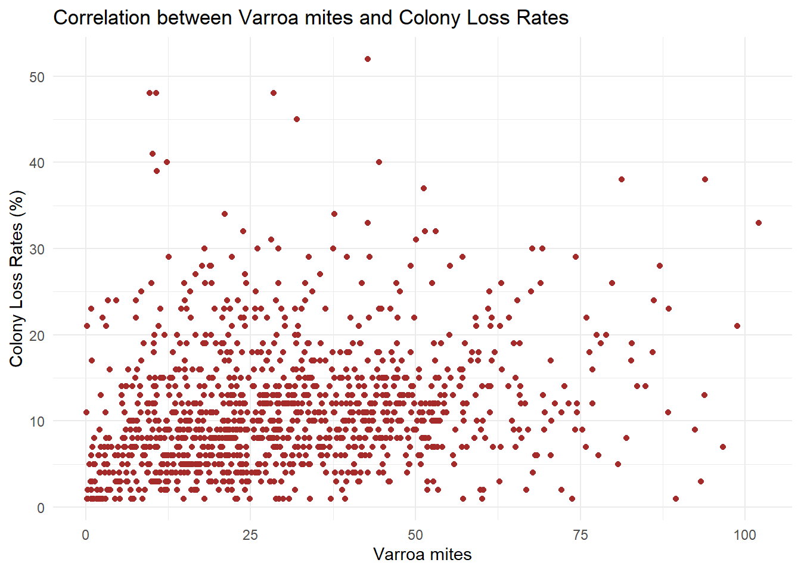
As we can see there is a steady slow increase, between the factors of Varroa mites and the percentage of bee colonies lost.

The statistical test to measure the correlation, states there does seem to be a significant connection between these two factors. Specifically, the analysis showed that when a higher percentage of colonies have Varroa mite infestations, a higher percentage of colonies are also lost. And when fewer colonies have mites, fewer colonies are lost.

The correlation test suggested this is a moderate strength positive relationship, so the trends don’t match perfectly, but they seem closely related based on the data.

We can’t definitively prove the mites directly caused the losses from this. But the significant correlation does suggest that these medical issues faced by bee colonies are linked to their survival rates.

## Geographic Patterns
For this analysis we need to load sf package, as we are going to make a choropleth map of the United State. We want to find how colony losses vary across the continental. We might see some region vary in shade compared to other places.

```toml
merged_data <- left_join(states_needed, colony, by = c("NAME" = "state"))

ggplot(merged_data, aes(fill = colony_max)) +
  geom_sf() +
  coord_sf(xlim = c(-125, -65), ylim = c(25, 50))+
  labs(title = "Colony Losses Across the US",
       fill = "Colony Losses") +
  scale_fill_viridis_c(option = 'mako') +  
  theme_minimal()
```
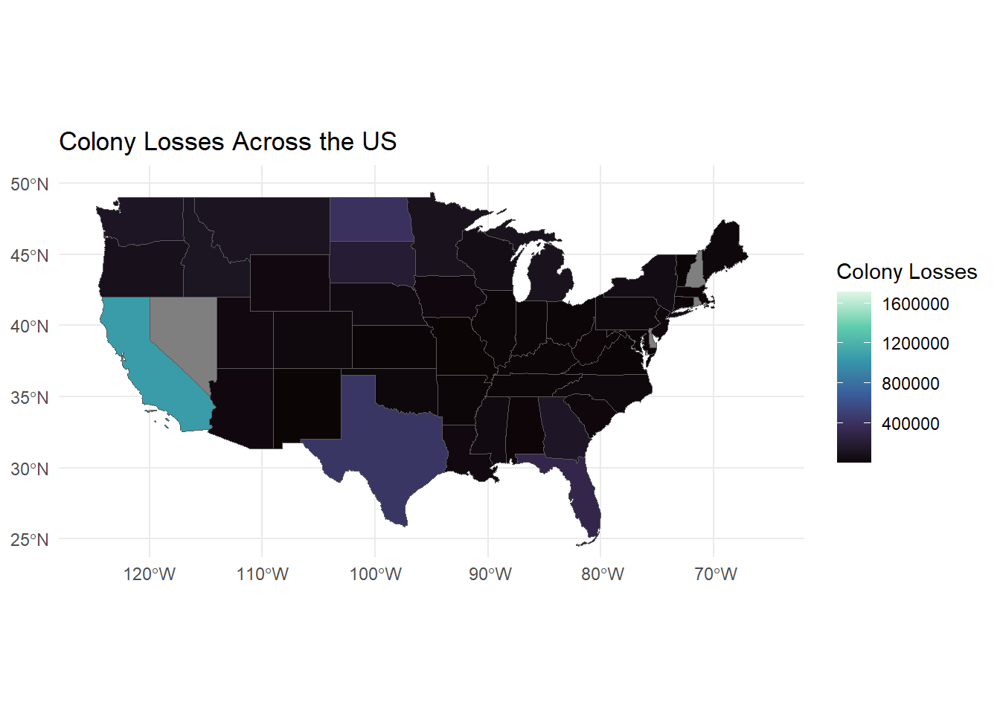

Based on the map data, there isn’t a strikingly significant difference in color indicating regional patterns of colony loss rates across the United States. However, certain states do stand out with higher losses, notably California, which recorded over estimated around 900,000 colony losses.

California’s major agricultural industry likely explains its high colony losses. As the top producer of many bee-pollinated crops like almonds, declines in honey bee health could significantly impact crop pollination and food production there. California also has major commercial beekeeping operations that are affected by high mortality rates.

According to an article by Aaron Smith, California produces about 80% of the world’s almonds in over 1 million acres of orchards. In February, 90% of all US honey bees are transported there to pollinate almond blooms. This reliance on imported bees, despite increasing almond acreage, may pressure honey bee health.

States like Texas and Florida saw growth in colonies over the past five years. Texas has gained beekeeping popularity and implemented supportive regulations. Florida produced 8 million pounds of honey in 2021 from over 650,000 colonies( USDA 2022) However, its climate also aids bee pests and diseases that can raise colony los

In summary, the enormous role of agriculture and bee-pollinated crops in states like California, Texas, and Florida make honey bee health especially important. Their large commercial operations and warmer climates also introduce stressors that can negatively impact colonies. Managing bee health in major farm states is key to supporting crop pollination and food supply nationwide.

## Seasonal Analysis
Understanding if certain stressors consistently peak seasonally can identify critical time periods to target interventions. A stacked bar visualization summarizes monthly stressor prevalence to reveal hazardous seasons. If the data shows clearly defined periods of increased stressors, we can target protective measures during those vulnerable seasons.

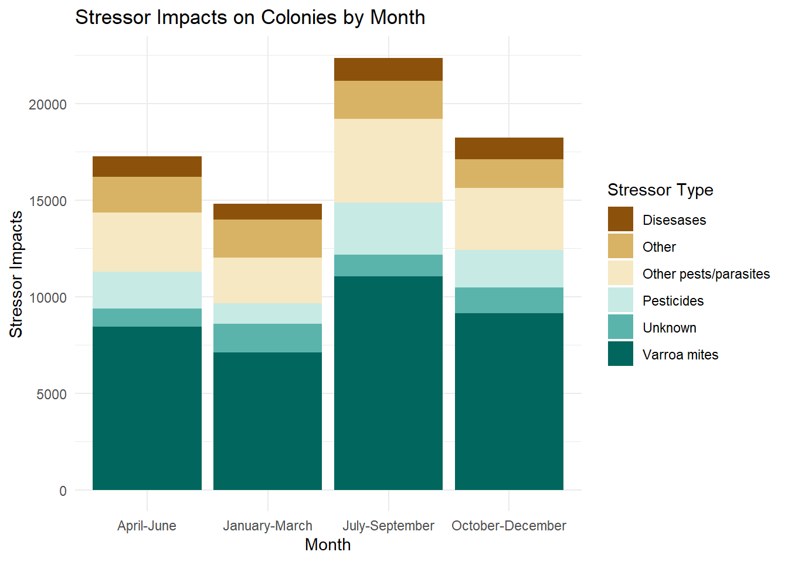

Varroa mites clearly have the highest prevalence, affirming earlier correlations with colony losses. Other pests and parasites also show substantial impacts across years and seasons.

Pesticide usage peaks between July-September, likely coinciding with crop treatments. Pesticide exposure can have complex immediate and long-term consequences on bee health depending on various factors.

The Other stressor category highlights gaps in current understanding. It potentially includes threats like weather extremes, habitat loss, new pathogens, and genetics. Better characterizing factors underlying colony declines is an area needing further exploration.

Factors such as parasites, pesticides, and climate events are key contributors to concerning declines in bee populations, though their impact levels might change over time. Studying stressor trends allows us to identify whether specific stressors are becoming more or less influential. By employing a stacked area chart, we can visualize the cumulative impacts over multiple years, shedding light on intensifying threats and assessing the progress made in dealing with existing challenges. Monitoring stressors provides valuable insights for prioritizing solutions and making informed projections.

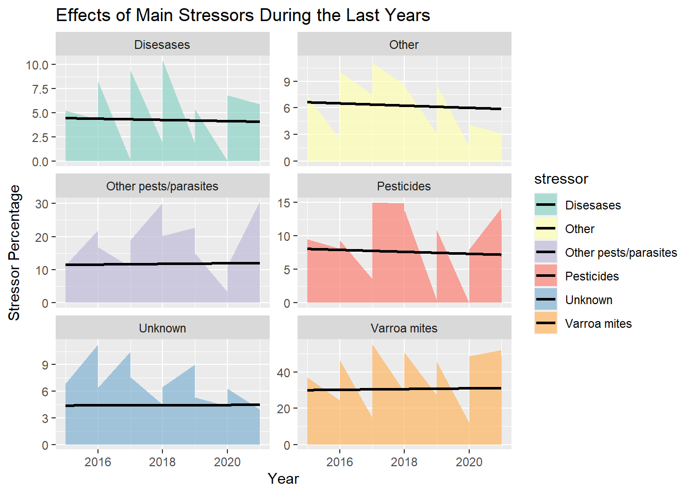

The stacked area chart shows some fluctuating stressor impacts early each year, potentially due to seasonal or data collection factors. Varroa mites consistently have the highest impact across all years.

The “Other” stressors, assumed to be environmental threats like weather extremes, reached a low point in 2020. Similarly, unidentified factors were also lower that year compared to prior years.

In contrast, parasites and pesticides display concerning upward trajectories over the time period. Research links pesticides to health issues like farmer poisonings and environmental contamination, yet industry sales continue rising (Rueter, 2022).

While some stressors fluctuate, likely from seasonal shifts, the escalation of parasites and pesticides indicates persisting and growing threats. Despite known damages, certain stressors are increasing as profits take priority over protecting pollinator health.

## Intervention Analysis

Beekeepers employ a variety of management practices to maintain hive health and counteract losses, including techniques like requeening colonies or replacing old comb.

It’s essential to know how often beekeepers in different places improve their hives. This helps us figure out where to focus on teaching and providing financial help to those who need it the most. By comparing states, we can see which areas are doing well and which ones need more support. Here let’s see which states have seen the biggest growth in renovation rates over the past decade?
```toml
colony_chg <- colony %>%
  group_by(state) %>%
  summarise(chg = last(colony_reno_pct) - first(colony_reno_pct))

# Take top 5 by largest increase
top_states <- colony_chg %>% 
  filter(state != "Other States")%>%
  
  arrange(desc(chg)) %>%
  head(n = 5)

ggplot(top_states, aes(x = state, y = chg)) +
  geom_bar(stat = "identity", fill= "lightblue")+
   geom_text(aes(label = chg), vjust = 0, size=3)+
  labs(title = paste("States with the Most Colony Renovation Percentage Growth"),
       x = "States",
       y = "Avg Renovation %") +
  theme_minimal() 
```
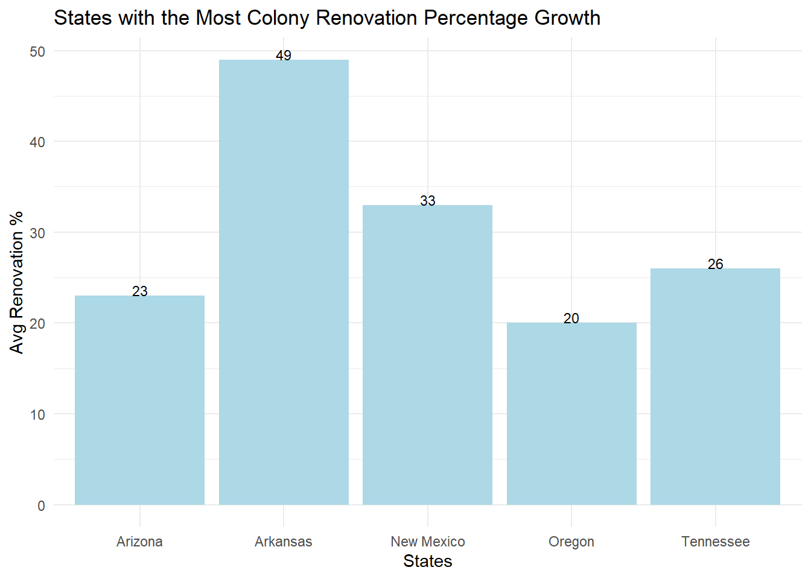

The states with the highest growth in colony renovation rates over the past quinquennial are concentrated in the southern and western regions of the country. Arkansas saw the greatest average increase at 49%, followed by other states like New Mexico, Arizona, Oregon, and Tennessee.

Arkansas’ high rate may be partially attributed to the discovery that lineages of early European honeybees, thought to be extinct, still persist there. As discussed in a High Plains Journal article, these bees likely adapted to thrive in Arkansas’ climate and rich biodiversity, including 400-650 native bee species. The adapted genetics could necessitate more active colony management through renovations.

In general, several factors could be driving higher renovation rates in these states. Agricultural demands for specialty crop pollination in western states like Oregon may motivate interventions to strengthen colonies. Some states may also offer tax incentives promoting beekeeper renovation activities.

However, negative pressures like urbanization and habitat loss in rapidly developing areas can also force increased hive manipulations to compensate. Disease and pest problems require renovations to replenish colonies. A mix of positives like pollination needs and negatives like diseases and urbanization are likely spurring renovations in the top states.

While the specific reasons vary, the concentration of high renovation rate increases in southern and western states points to regional traits and incentives influencing beekeeper hive management decisions. Identifying the distinct drivers in each state can guide policies to support healthy bee populations (Miller, 2023).

The level of active “renovation” interventions varies based on the needs of each apiary. Understanding if higher renovation rates in a state correspond to reduced colony losses can provide insight into whether these labor-intensive practices are an effective strategy for improving outcomes.

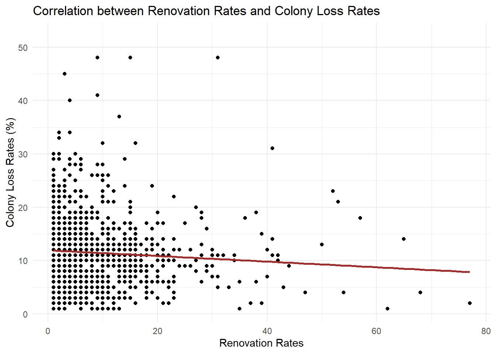

The data reveals a clear negative correlation between yearly state-level colony renovation rates and colony loss rate. As renovation rates increase across states, loss rates decline. This suggests renovation helps protect colony health and prevent losses.

Beekeepers employ various renovation techniques to rejuvenate hives.This includes requeening colonies with new young queens for improved productivity( NASS). Brood pattern manipulation like culling drone comb to limit Varroa mite reproduction. Splitting large hives into multiple smaller colonies to prevent swarming. Sanitizing equipment with irradiation to reduce disease pathogens.

These targeted manipulations provide benefits like lowered infestations and infections, stronger brood development, and overall restoring of colonies. However, renovations also result in costs of time, labor, and equipment that must be balanced. Frequent splitting can also reduce honey yields in the short term.

Further research can help improve these strategies, ensuring that they provide maximum benefits while causing minimal disturbances from the interventions.

## Clustering Analysis

Clustering is a technique of data segmentation that partitions the data into several groups based on their similarity.

```toml
data <- colony
data <- na.omit(colony)

selected_columns <- data %>%
  select(colony_n, colony_added, state)

# scale the data
scaled_data <- selected_columns %>%
  mutate(colony_added_scaled = scale(colony_added))

# hierarchical clustering using hclust
hclust_model <- hclust(dist(scaled_data[, c("colony_n", "colony_added_scaled")]))

k <- 5
clusters <- cutree(hclust_model, k)

scaled_data$cluster <- factor(clusters)

ggplot(scaled_data, aes(x = colony_n, y = colony_added_scaled, color = cluster, label = state)) +
  geom_point(size = 3) +
  geom_text(hjust = 0, vjust = 0, check_overlap = TRUE) +  # Add state labels
  labs(title = "Hierarchical Clustering of Colony Data",
       x = "Number of Colonies",
       y = "Colonies Added (Scaled)",
       color = "Cluster")
```
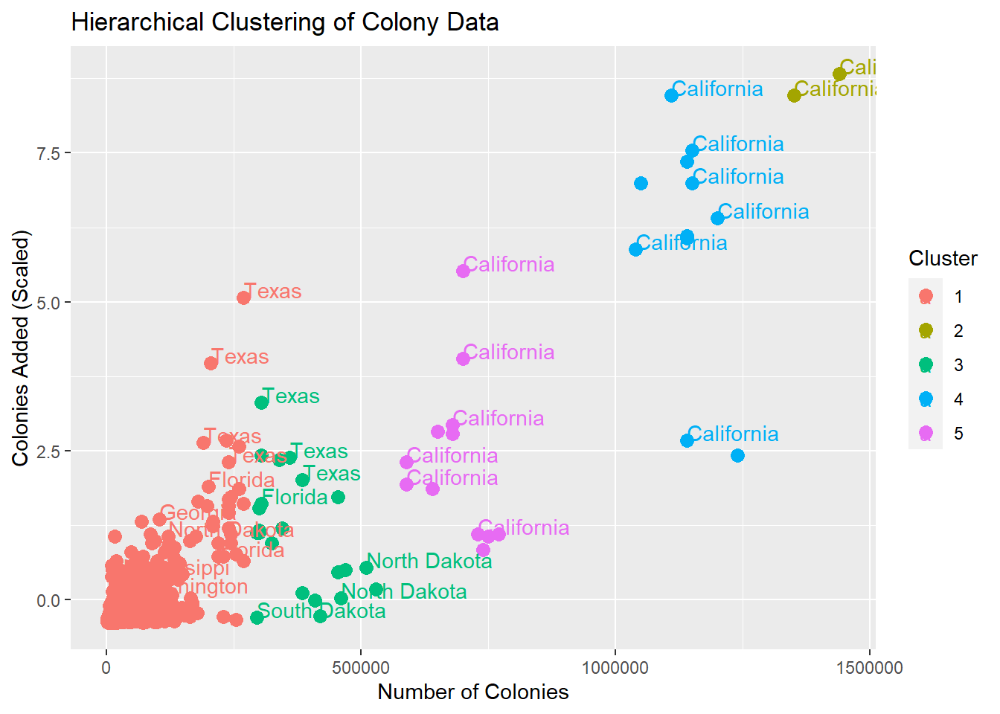

The clustering plot shows a positive correlation between the two variables. When a state, like California, appears in multiple clusters, it indicates that California’s colony data has unique characteristics setting it apart from other states. Possible reasons include distinct beekeeping practices, different environmental conditions, or agricultural activities. Additionally, the availability of comprehensive data for California compared to other states might contribute to more stable and consistent clustering results.

## Conclusions
The research indicates that bee populations are declining overall, and there are specific seasonal, regional, and stress-related patterns in how colonies are affected. The main threats to bees include Varroa mites, pesticides, and changes in land use.

To address this decline and support beekeepers, targeted solutions are needed. These solutions should involve strategic interventions that promote sustainable pollination services. It’s crucial to base these efforts on data analysis to ensure they are evidence-based and effective.

Moreover, continuous monitoring of the stressors affecting bee colonies and the interventions implemented is vital. This allows us to adapt our protection measures as threats evolve over time.

By being diligent and innovative in our approach, we can create a resilient future for both bees and agriculture, ensuring a healthy ecosystem and ample food production.

There are more than 20,000 known bee species worldwide, with approximately 4,000 of them native to the United States (USGS).

Native bees have been present in the United States long before European honeybees were introduced by settlers. While honeybees play a crucial role in pollinating certain crops like almonds and lemons, native bees, such as the blue orchard bees, excel at pollinating many crops, especially those that evolved in the Americas. Some native bees, like bumblebees, can perform “buzz pollination.” They vibrate their flight muscles while attached to a flower, causing the release of pollen, which is essential for certain plants’ pollination. In fact, native bees are estimated to pollinate around 80 percent of flowering plants worldwide.

This raises important questions around whether current conservation efforts are focused on the right bee species.

## References
Bees | National Wildlife Federation. (n.d.). Retrieved from https://www.nwf.org/Educational-Resources/Wildlife-Guide/Invertebrates/Bees

How many species of native bees are in the United States? | U.S. Geological Survey. (n.d.). U.S. Geological Survey. Retrieved from https://www.usgs.gov/faqs/how-many-species-native-bees-are-united-states

Miller, F. (2023, June 25). Researchers trace ancestry of Arkansas honeybees to original ‘colonists’ | Livestock | hpj.com. HPJ. https://www.hpj.com/livestock/researchers-trace-ancestry-of-arkansas-honeybees-to-original-colonists/article_97a8f88e-2a28-11ee-88df-7bb007a206b1.html

Rowland, B. (2021, November 9). Climatic drivers of honey bee disease - Press Office - Newcastle University. Newcastle University. https://www.ncl.ac.uk/press/articles/latest/2021/11/climaticdriversofhoneybeedisease/

Rueter, G. (2022, December 1). Rising pesticides use harming farmers, environment: report – DW – 01/12/2022. DW. https://www.dw.com/en/pesticide-atlas-2022/a-60390427

USDA - National Agricultural Statistics Service - Surveys - Honey Bee Surveys and Reports. (2022, October 5). USDA. https://www.nass.usda.gov/Surveys/Guide_to_NASS_Surveys/Bee_and_Honey/

